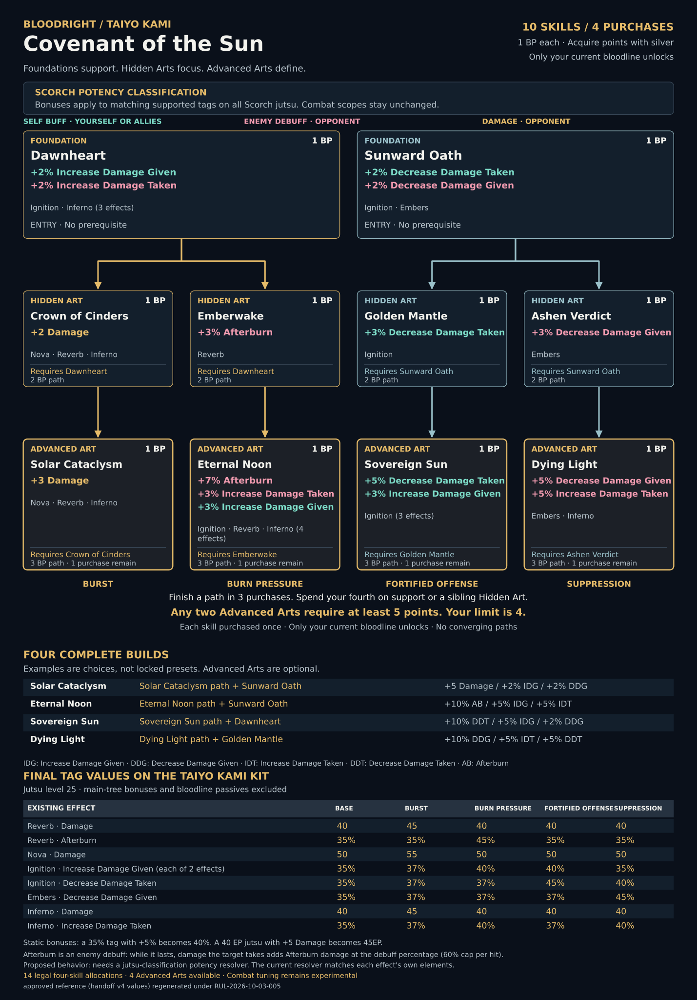

# Bloodright: bloodline refinement through meaningful choices

**Design handoff for Claude / Fable 5.1 Ultracode.**  
**Status:** experimental design direction established; 43 remaining public bloodlines approved for draft planning; Taiyo Kami is the worked example. Potency scope and balance ceilings follow RUL-2026-10-03-005; Blood-Enchanted Eyes follows RUL-2026-10-03-006. Final new-tree tuning remains subject to user review.  
**Scope:** planning, evidence and readable tree designs. This document does not authorize a release or engine implementation.

## 1. Purpose and boundary

Bloodright is a small, exclusive section of the skill tree that lets a player refine the bloodline they currently possess. The main skill tree and equipped kit establish the character's core build. Bloodright adds a few consequential choices that emphasize existing strengths, trade breadth for commitment, and create alternative ways to use that kit. A player cannot buy everything.

Bloodright should complement offensive, defensive and balanced cores rather than require players to follow one prescribed build. A coherent partial route and a useful fourth purchase matter. Strong prerequisites are acceptable; a mandatory universal opener or a single always-best allocation is not the goal.

| System | Owns | Does not own in this proposal |
|---|---|---|
| Normal skill tree | General combat effects, general utility, broadly accessible character development and the core build | Bloodline-exclusive potency packages or a second free copy of Bloodright's bonuses |
| Bloodright | Static potency increases to existing supported tags on jutsu of the current bloodline's qualifying element/classification; thematic specialization and tradeoffs | New jutsu, extra tags, passive-stat replacement, AP/cooldown changes, damage-type conversions or unsupported mechanics |

Ordinary skills can still influence the outcome of a Bloodright-enhanced jutsu through their normal combat effects. That interaction must be modeled. Broad/non-bloodline potency on the normal tree is **not yet approved**; if proposed later, it needs a combined budget and stacking audit. Do not assume it is absent from a future implementation merely because it is outside this planning pass.

## 2. Established structural decisions

| Rule | Design contract |
|---|---|
| Available choices | At most 10 named skills per bloodline; fewer if the kit cannot sustain ten meaningful choices |
| Spend limit | 4 Bloodright Points (BP), separate from normal skill points |
| Acquisition | BP acquired with silver; exact price and additional acquisition gates remain undecided |
| Purchase | Each skill costs 1 BP and is purchased once, without incremental ranks |
| Ownership | Only the currently possessed bloodline's section unlocks |
| Tiers | Foundations, Hidden Arts, Advanced Arts |
| Foundations | Broadly useful support within the eligible bloodline kit |
| Hidden Arts | Stronger, focused intermediary commitments |
| Advanced Arts | The most valuable route rewards; at most one affordable per player |
| Paths | Forks only; no convergence or multi-parent dependencies in this version |
| Meaningful choices | Several viable finished builds; players cannot own the whole tree |

“10” is the available-node ceiling, not ten spendable BP. “4” is the total player budget, not four points per route. The Advanced Art restriction must follow from costs and prerequisite closure; UI text alone is insufficient.

Short support branches and deeper commitments are welcome when each purchase earns its cost. A standard three-purchase route leaves one purchase for a sibling Hidden Art or another Foundation. A four-purchase route may exist if its opportunity cost is justified. Do not create two short Advanced paths whose combined ancestor set fits inside four purchases.

Reset/refund cost, BP retention after a bloodline swap, acquisition pacing and silver pricing remain user decisions. Irrespective of retention policy, inactive bloodlines must not continue granting bonuses. Do not silently spend ordinary SP or use cosmetic folders as the only enforcement mechanism.

## 3. How potency works in this design

Only existing supported effect rows are enhanced. A node selects the bloodline's potency element/classification and a supported tag, or all supported tags if explicitly justified. Jutsu names on a card describe example coverage; they are **not** selectors.

All bonuses are static. A 35% tag with +5% becomes 40%, not 36.75%. Every modifier except flat Damage is displayed with `%` (“+5% Afterburn”, “+3% Lifesteal”, “+3% Heal”); explain static addition in the notes. Damage is a raw EP addition shown as “+2 Damage”, never “Damage %”. Use this player-facing example: **A 40 EP jutsu with +5 Damage becomes 45EP.** On a static-calculation Heal row a +1% Heal display adds 1 heal power (10 HP per tick); that display conflict is recorded in `bloodright/OPEN_DECISIONS.md` rather than reverted.

Afterburn is an **enemy debuff**, not a damage instance. For its existing round duration, damage you deal causes extra Afterburn damage at the debuff's percentage. Afterburn potency increases that percentage; it does not add a standalone hit or extend the duration. Count both the application row and the subsequent damage instances it can enhance; verify proc interactions in source rather than assuming recursion or exclusions.

The potency effect therefore uses static arithmetic even when the modified tag is percentage-valued. Preserve the distinction between the modifier's calculation mode and the affected tag's calculation mode. Level-scaled baseline power must be evaluated at the declared jutsu level before applying the flat increase; display percentage caps where relevant.

Current supported tags: Damage, Increase Damage Given, Decrease Damage Given, Increase Damage Taken, Decrease Damage Taken, Afterburn, Lifesteal, Reflect, Increase Heal and Heal. “All supported” does not include every engine effect. Absorb, Shield, Wound, Poison, Drain, Vamp, Stun, movement, injection, summons, prevention effects, AP and cooldown are not potency targets in this design. Copy and Mirror are removed and must not underpin any route.

Audit every matching row. If a jutsu has two Increase Damage Given rows, both receive the qualifying modifier. A +5% node does not mean +5% final damage, and two boosted rows must not be collapsed into one for balance accounting.

### Potency identity versus combat scope (RUL-2026-10-03-005)

Bloodright potency is **classification-element wide**, not bloodline-ID scoped. A modifier applies to matching supported tags on **every jutsu of the Bloodright's qualifying element/classification**: the bloodline's own jutsu, other bloodlines' jutsu of that element, NORMAL/SPECIAL/EVENT/FORBIDDEN jutsu and injected jutsu alike. Shared elements are expected, not collisions. Taiyo Kami's scope reads: *Bonuses apply to matching supported tags on all Scorch jutsu.*

Bloodline id, bloodline ownership, equipment sources, injected-child provenance and jutsu names are **not** selectors. Equipment gates still decide whether a jutsu can be cast; they never narrow eligibility. Each row keeps its original combat scope: recipient, element, stat and general-type filters are unchanged. A broad defensive effect must not become element-only defense just to make it match potency.

The qualifying element is the kit's signature element (the non-None element on its damage/pierce rows). A kit with several signature elements is a **multi-element** classification for director review; a kit with none **requires a classification extension** (a new jutsu classification, never a bloodline-id selector). Targeting `None` would reach every non-elemental row in the game and is not an option. The source's only jutsu-level element derivation is the union of a jutsu's row elements (`checkJutsuElements`, `app/src/libs/train.ts` 189–198); kit jutsu with no qualifying element on any row qualify only through an authored jutsu classification, and the classification table lists them.

The current resolver matches each effect row's own `elements` (absent/empty → `None`); it has no jutsu-level classification. **A jutsu-classification potency resolver is the required engine change** (ENGINE_GAP_REGISTER G1/G2). It is an engine gap, not a design question, and the design is not narrowed back to bloodline-only behavior to fit the current resolver. Off-kit coverage stays “unverified” until a non-bloodline jutsu catalog is captured.

The earlier +5% narrow / +3% broad / +2% unrestricted rule was an earlier scope experiment, not a universal node budget to reintroduce.

## 4. Taiyo Kami reference: Covenant of the Sun

The generated `bloodright/trees/taiyo_kami.{json,md,svg}` projection is the current reference; its values are copied unchanged from the approved handoff, which stays under `bloodright/examples/` as historical evidence (earlier scope wording and Damage label). It keeps the latest correction: **Solar Cataclysm has only +3 Damage; Eternal Noon also receives +3% Increase Damage Given.** Taiyo Kami is a calibration reference, not a template.

All ten nodes cost 1 BP. Bonuses apply to matching supported tags on all Scorch jutsu under the proposed classification behavior. No row's original combat scope changes. Route identities: Burst +5 Damage, Burn pressure +10% Afterburn, Fortified offense +10% Decrease Damage Taken, Suppression +10% Decrease Damage Given.

| ID | Skill | Tier | Requires | Exact bonus and recipient |
|---|---|---|---|---|
| 01 | Dawnheart | Foundation | None | +2% Increase Damage Given (self buff); +2% Increase Damage Taken (enemy debuff) |
| 02 | Crown of Cinders | Hidden Art | 01 | +2 Damage (damage to enemy) |
| 03 | Solar Cataclysm | Advanced Art | 02 | +3 Damage (damage to enemy) |
| 04 | Emberwake | Hidden Art | 01 | +3% Afterburn (enemy debuff) |
| 05 | Eternal Noon | Advanced Art | 04 | +7% Afterburn (enemy debuff); +3% Increase Damage Taken (enemy debuff); +3% Increase Damage Given (self buff) |
| 06 | Sunward Oath | Foundation | None | +2% Decrease Damage Taken (self buff); +2% Decrease Damage Given (enemy debuff) |
| 07 | Golden Mantle | Hidden Art | 06 | +3% Decrease Damage Taken (self buff) |
| 08 | Sovereign Sun | Advanced Art | 07 | +5% Decrease Damage Taken (self buff); +3% Increase Damage Given (self buff) |
| 09 | Ashen Verdict | Hidden Art | 06 | +3% Decrease Damage Given (enemy debuff) |
| 10 | Dying Light | Advanced Art | 09 | +5% Decrease Damage Given (enemy debuff); +5% Increase Damage Taken (enemy debuff) |

There are two independent foundations, each forking into two Hidden-to-Advanced paths. The eight connections are 01→02, 02→03, 01→04, 04→05, 06→07, 07→08, 06→09 and 09→10. Each Advanced route costs three purchases. Two Advanced Arts sharing a Foundation require five purchases; a pair from different Foundations requires six. The cap is four.

### Actual jutsu coverage

The supplied content snapshot is dated 2026-10-01, with baseline values evaluated at **jutsu level 25**, not player level 25. These are captured-data examples, not a newly verified live readback.

| Jutsu | Supported rows at level 25 | Coverage notes |
|---|---|---|
| Solar Reverb | Damage 40; Afterburn 35% | Damage nodes affect this and two other attacks; Afterburn nodes strengthen its enemy debuff, which can enhance multiple subsequent damage instances |
| Incandescent Nova | Damage 50 | Its Wound 25% is unchanged |
| Stellar Inferno | Damage 40; Increase Damage Taken 35% | Exposure is applied to the enemy |
| Celestial Ignition | Increase Damage Given 35% twice; Decrease Damage Taken 35% | Both distinct damage-given rows gain potency; retain their original stat/element filters |
| Radiant Embers | Decrease Damage Given 35% | Enemy damage suppression; its separate self Shield is unchanged |

All five records have cooldown 7 in the snapshot. The three damage actions cost 60 AP; Celestial Ignition and Radiant Embers cost 40 AP. Percentage buffs/debuffs and Afterburn have two-round values in the captured records; actual useful timing must be verified against the combat source before making rotation claims.

### Complete four-purchase examples

| Build | Purchases | Damage | Self IDG | Enemy IDT | Enemy Afterburn | Self DDT | Enemy DDG |
|---|---|---:|---:|---:|---:|---:|---:|
| Burst | 01, 02, 03, 06 | +5 | +2% | +2% | — | +2% | +2% |
| Burn pressure | 01, 04, 05, 06 | — | +5% | +5% | +10% | +2% | +2% |
| Fortified offense | 01, 06, 07, 08 | — | +5% | +2% | — | +10% | +2% |
| Suppression | 06, 07, 09, 10 | — | — | +5% | — | +5% | +10% |

IDG = Increase Damage Given; IDT = Increase Damage Taken; DDT = Decrease Damage Taken; DDG = Decrease Damage Given. These are per-matching-row potency additions, not final combat percentages. Example: the burn build makes Reverb's Afterburn 45%, Inferno's exposure 40%, and **each** Ignition damage buff 40%.

These examples do not exhaust the tree. There are 14 legal full-budget allocations. All 14 were numerically non-dominated in the existing per-effect delta audit, and every node appeared in at least one of them. Maximum individually achievable additions are +5 Damage, IDG +5%, IDT +7%, Afterburn +10%, DDT +10%, DDG +10%; those maxima are not all jointly attainable. This is a structural/arithmetic result, **not proof of equal combat strength**. Main-tree effects, equipment, passives, uptime and delivery were not simulated.

## 5. Balance method for the remaining roster

Use the same access budget and opportunity-cost rules, not the same raw numbers for every bloodline. Start from a declared finished kit and then divide its improvement across nodes.

**Ceilings (RUL-2026-10-03-005), evaluated over every legal prerequisite-closed allocation, not only the advertised routes:**

| Tag | Ceiling |
|---|---|
| Damage | hard maximum +5 |
| Lifesteal | hard maximum +5% |
| Afterburn | hard maximum +15% |
| Every other supported tag | +10%; exceeding it needs a recorded reason and a director-review exception (`director_exceptions` in the tree JSON), never silent arithmetic |

The +5 / +10 / +15 totals are **guardrails and warning thresholds, not targets** (`bloodright/BALANCE_REVIEW_METHOD.md`, 2026-10-04): balance follows meaningful opportunity cost, not equal-looking printed totals. +5 Damage is not the normal Damage route and Hidden +2 / Advanced +3 is no longer a default; flat Damage is judged base → final on every affected row against the player-jutsu tiers (38 Light, 40 Normal, 45 High, 50 Nuke), and any result above 50 needs a recorded `above_nuke_rationale` and director review. Use the method's Foundation Sentence Test, Advanced-Art identity test and fourth-BP audit; row-weighted totals are diagnostics only. The earlier guardrails (Damage 6, other tags 12) are obsolete.

1. Identify the baseline kit, role, offense scaling, limitations and actual supported rows. Do not invent a missing heal/reflect/burn tag to produce a familiar archetype.
2. Propose a primary emphasis, a secondary emphasis and lesser support. The earlier 10/5/3 idea is a design heuristic, not an entitlement to +10 Damage or every tertiary stat. Taiyo Kami's reviewed result is the stronger reference.
3. Count affected jutsu, effect rows and available casts, including repeated buffs and reachable injected actions. Separate application coverage from downstream coverage: Afterburn may be applied by one jutsu yet enhance multiple damage instances during its duration. Do not infer its value from the number of application rows alone. Duration, action cost, cooldown, range, target restrictions, items and mode legality change realized value.
4. Calculate exact before/after powers at the same declared jutsu level. Distinguish raw powers, percentage-valued tags, and their later combat multiplication. Consider caps and loss of marginal value near 100%.
5. Enumerate every affordable prerequisite-closed allocation, including hybrids with no Advanced Art. Find the strongest unadvertised combinations and the worst-value purchases.
6. Compare the added benefit against the unmodified bloodline and peer trees. Equalize meaningful marginal opportunity without pretending different bloodline ranks and native kits were equally strong beforehand.
7. Show how the main tree, passive bloodline effects and equipment interact. Enhancing a self buff on a bloodline jutsu may increase damage from ordinary jutsu while that buff is active; enhancing an enemy debuff may amplify other sources against that enemy. Restricted casting scope does not guarantee restricted downstream benefit.

Keep existing weaknesses meaningful. A defensive capstone should not also be the best burst purchase with no opportunity cost. Two equal percentages on different tags need not be equivalent. Heal, Lifesteal, Reflect, multi-row damage buffs and broad enemy exposure need particular care.

The initial target is 2–3 genuinely distinct full-budget options for each approved kit. Taiyo Kami supports four named paths; other trees need not have the identical two-root/four-capstone arrangement. If a small kit supports fewer meaningful paths, explain the limitation and propose an exception rather than creating filler.

## 6. Presentation contract

Every node shows a unique thematic name, tier, 1 BP cost, exact supported tag names, static values (`%` on every non-Damage modifier) and prerequisites; the eligibility scope is stated once for the tree (“Bonuses apply to matching supported tags on all Shadow jutsu.”). Describe the affected jutsu fully in the accompanying dossier. Only abbreviate in tables with a visible key.

Use a shared text/icon legend and matching effect-text colors: Taiyo Kami uses teal self buffs, rose enemy debuffs and amber direct damage. **Afterburn and Increase Damage Taken are enemy debuffs.** Derive recipients from the actual effect targets; do not globally assume every occurrence of a tag targets the same side. Do not repeat Self Buff, Enemy Debuff or Damage role labels on the individual cards. Remove visible skill numbers from card titles and prerequisite labels; retain stable internal IDs in JSON and audit tables.

Poster notes should explain static addition and use the EP example above. Omit the redundant notes “Existing supported tags only,” “Original scope preserved” and “Damage bonuses add power.” This is a presentation cleanup, not a change to the technical eligibility or combat-scope rules.

Use clear top-down forks and visually distinct Advanced Arts. Deterministic SVGs are the source for accurate trees; themed generated posters are later presentation work. Match the approved hybrid's readability if art is eventually requested: dark calm cards, selective bright theme art, no ornate clutter over text. No joke names such as Kaboom in serious trees.

## 7. Engine work to identify, not implement

| Area | Current evidence / required decision |
|---|---|
| Element + tag selectors | Existing potency supports element matching combined with a specific tag or all supported tags |
| Jutsu-classification potency resolver | Proposed; matches the jutsu's qualifying element/classification while each row keeps its own combat scope and filters (G1/G2) |
| Classification coverage | Shared elements are expected. Multi-element kits need a director choice; kits with no signature element need a classification extension; kit jutsu with no qualifying element on any row need an authored jutsu classification; off-kit coverage is unverified |
| BP and silver | Current purchase path checks ordinary `user.skillPoints` and `costSkillPoints`; this review did not establish a separate BP ledger or silver acquisition path |
| Current-bloodline gate | Server-side activation/eligibility and swap behavior must be specified; folders alone do not enforce this |
| Prerequisites | Current purchase path checks every required skill ID; a single-parent fork fits that rule |
| Advanced limit | Prove through graph cost now; later implementation must preserve that proof under resets, swaps and reactivation |
| Repeated rows/injection | Both matching rows can benefit; injected action timing, ownership and eligibility require explicit source checks |

Current mechanical sources reviewed at `studie-tech/TheNinjaRPG@16498fd776fad9c91e4b84efed4380fe3a487050`: `app/src/libs/combat/potency.ts`, `app/src/server/api/routers/skillTree.ts`, `app/src/validators/bloodline.ts`. Inspect those exact files and refreshed counterparts before making implementation claims. The potency function clones effect rows, applies matching modifiers once, includes jutsu-level scaling, clamps power and clears per-level scaling on the result. Do not apply the bonus again to ticks or transferred effects.

## 8. Eligibility and acceptance

The roster is a user-sorted allowlist, not “every record returned by an endpoint.” Borrowed Awakening, custom bloodlines and bloodlines with no bloodline jutsu are excluded. The user approved the remaining public cohort on 2026-10-02 America/Chicago: 39 core candidates plus Godstorm Eclipse, Night Parade of A Thousand Demons, Sands of Time and Tetsugan. Taiyo Kami is the separate reference.

The user explicitly excluded Astral Ascendant, Blood-Enshrined Eyes, Blood-Enthralled Eyes, Blue Edge Eyes, Ethereal Regent, Eyes of the Forsaken Heir and Youso Shiroi because they are not public. Shiroi Youso remains included. The 35 other hidden records are not part of this approved public batch; do not infer custom ownership from that status. The nine no-linked-jutsu records are excluded from this snapshot-based scope under the earlier no-jutsu rule. New evidence may justify a future roster amendment, not silent inclusion.

See [ROSTER_REVIEW.md](bloodright/ROSTER_REVIEW.md) and `bloodright/roster.json` for all 95 dispositions and the 43 approved remaining IDs. The eligibility gate is resolved for that batch; begin without requesting approval again. Deferred or newly found records do not block approved work.

Final acceptance requires complete coverage of approved IDs, meaningful legal choices, exact tag coverage, transparent engine dependencies and comparable balance evidence. Unsupported assumptions remain visible rather than being described as implemented features. Silver pricing, reset/refund and BP retention on swap, multi-element and classification-extension choices, any exception above the ceilings, normal-tree potency policy and final tuning are still user decisions.

## 9. Repository and evidence notes

The current `CLAUDE.md` at reviewed main requires a durable task brief, branch ownership, evidence-first work, no live-game pushes, user ownership of balance and an exact-SHA handoff. The launch contract is [state/prompt_bloodright_planning.md](../../state/prompt_bloodright_planning.md). New proposals must remain proposals; no other active workstream is reordered by this handoff.

The public content snapshot predates this brief; hidden records are older still. An attempted public name-list refresh did not return usable data, so no current-completeness claim is made. The main-branch Taiyo Kami capture manifest stages reads; it is not itself a successful readback. Provenance and source hashes are recorded under `bloodright/evidence/`.
