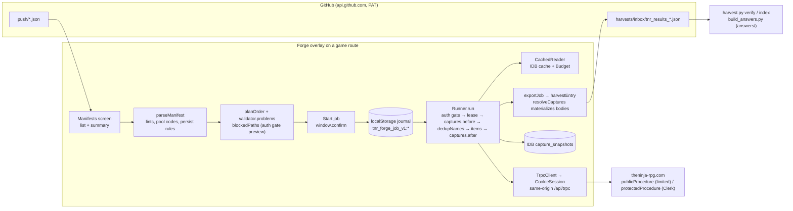

# A. Current-state architecture map: Forge 0.4.0 and Builder v4.32

**Status:** planning evidence, no implementation. Part of the Forge Next planning package (`docs/PLAN_2026-09-12_forge_next.md`).
**Evidence base:** every Forge file under `forge/src/` read in full at `main@305a28f992e33194fbba279a3f32e698dfb2b67f`; `builder_bundle.js` v4.32 read at the same commit; line anchors are from that tree. Tier for every code claim below: Source-verified (repository source) unless marked.
**Design-document abbreviations (cited as `ABBR:line` or `ABBR §n`):** SSC = docs/design/FORGE_NEXT_SAFETY_STATE_PRESENTATION_CONTRACT.md at chatgpt/forge-quest-studio-foundation@824c4d58; MOB = docs/design/FORGE_NEXT_MOBILE_ACCESSIBILITY_AUDIT.md at chatgpt/forge-quest-studio-foundation@824c4d58; WCM = docs/design/FORGE_NEXT_WORKFLOW_COMPONENT_MAP.md at chatgpt/forge-quest-studio-foundation@824c4d58; CPY = docs/design/FORGE_NEXT_UI_COPY_AND_STATE_LANGUAGE.md at chatgpt/forge-quest-studio-foundation@824c4d58; QS = docs/design/FORGE_NEXT_QUEST_STUDIO.md at chatgpt/forge-quest-studio-foundation@824c4d58; RB = docs/design/FORGE_NEXT_REPO_BACKED_STUDIO_ARCHITECTURE.md at chatgpt/forge-quest-studio-foundation@824c4d58; AUD = docs/design/FORGE_CURRENT_UI_UX_BASELINE_AUDIT.md at chatgpt/forge-quest-studio-foundation@824c4d58; IDX = docs/design/FORGE_NEXT_UI_DESIGN_INPUT_INDEX.md at chatgpt/forge-quest-studio-foundation@824c4d58; BRF = state/prompt_forge_next_planning_resume_after_ui_recovery.md at chatgpt/forge-quest-studio-foundation@824c4d58; FBRF = state/prompt_forge_quest_studio_foundation.md at chatgpt/forge-quest-studio-foundation@824c4d58. Files that exist only on that branch carry the prefix `824c4d58:`. Those documents own the meaning of UI states and copy; this section records code facts and cites the owner rather than restating its rules (CLAUDE.md §7; BRF:110).

## A.1 The two tools at a glance

| | Builder v4.32 (`builder_bundle.js`, 104,958 bytes, one file) | Forge 0.4.0 (`forge/src`: 33 `.mjs` files, of which five are index barrels, so 28 implementation modules; 4,933 lines of JavaScript plus 5,014 lines of derived JSON; `forge_bundle.js` 397,984 bytes) |
|---|---|---|
| Host | Injected panel on any game page at `document-idle` (`builder_loader_user.js`); floating `▶ Build` button and a panel built through `R.innerHTML=...` (`builder_bundle.js:794`) | Entry at `/forge` arms the tab and hands off; overlay mounted on a real application route with the game's React/Clerk tree left alive underneath (`forge/src/ui/takeover.mjs:47-53`, `forge/src/main.mjs:75-166`) |
| Contract data | Fetched at every load from the moving `main` ref: `45c`, `32b`, `45g` (`builder_bundle.js:225-230`) | Bundled at build time from the pinned game source: `fields.json`, `nested.json`, `32b_DATA_pool.json` (`forge/build.mjs`, `forge/src/main.mjs:21-27`) |
| Procedure surface | 27 hard-coded paths (jutsu/item/bloodline/gameAsset/quests/profile/ai), plus any `proc` a capture block names | 43 audited procedures with kind, limiter and auth class (`forge/src/transport/procedures.mjs:24-82`); unknown paths throw |
| Wire format | Hand-built superjson meta, regex id scrape, `fetch` per call | Real superjson, tRPC 11 batch envelope derived from the adapter, id read from the decoded `baseServerResponse.message` (`forge/src/transport/outcome.mjs:41`) |
| Rate limit | Eight-try exponential backoff on a limiter hit, up to 60 s per wait (`builder_bundle.js:342,345`), limiter-phrase sniff on error bodies (`:263`) | Per-path sliding-window budget at margin 0.5 mirroring the server's weighted estimate; a 429 halts and pauses the job, never retries (`forge/src/budget/bucket.mjs:169-216`) |
| Durability | `localStorage` idmap `tnr_bk_idmap_v1` (`builder_bundle.js:551`); status rows live only in the panel DOM | Write-ahead job journal in `localStorage`, capture cache and immutable capture snapshots in IndexedDB, pre-create id snapshots, per-job tab lease |
| Ambiguity | A request that never answered is retried or re-run by hand; idempotency relies on the idmap | `SENT` items are reconciled against server state, never retried; ambiguous cases become `ORPHANED` for a human decision |
| Verification | v4.28 asserted-field postflight with one automatic read-back retry | Read-back on asserted keys, `verify: match|drift|unread`, `INCOMPLETE` job state and an `outcome` separate from `state` |
| Captures | `capture.before/after` with `select` projection and `scope` annotations, any procedure, full bodies always in the bundle (`builder_bundle.js:372-375`) | Summary captures by default; `persist:"full"` for seven audited point reads only, 512 KiB ceiling, fail-closed export (`forge/src/storage/captures.mjs:58-84`) |
| Manifest sources | Paste, `📄 Load` file (.json or .zip push pack), `⇩ Repo` picker with multi-select batch builds (`builder_bundle.js:831-871`) | GitHub contents API listing of `push/*.json` on `main`, one manifest per job (`forge/src/ui/app.mjs:186-207`). Ingress gap for the Studio seam: a build that lands on `studio/quest/<id>` (§A.11) reaches this picker only by copy/paste; see §A.8 item 6 |
| Results | `tnr_results_<ts>.json` committed to `harvests/inbox/` when Sync is on, `cfg: generated`, `checks` array | Same path and PAT key, `cfg: "forge"`, adds `state`, `outcome`, `forgeState`, `verdict`, `journal` (`forge/src/ui/app.mjs:369-406`) |
| Escape hatches | `skipPreflight`, `doctor`, `Map` export/import, paste | None that bypass a safety lint; `Export bundle`, `Export journal as text` |
| Tests | None | 293 socket-free tests across 13 files (`cd forge && npm test`) |

## A.2 Forge module map

Layers are built bottom-up and composed once in `compose()` (`forge/src/main.mjs:35-57`). Every test harness calls the same composition (`forge/test/compose.mjs`). The counting rule, stated once and used everywhere in this package: the tree holds 33 `.mjs` files, five of which are index barrels, so 28 implementation modules, plus two derived JSON contracts (`fields.json` and `nested.json`). `B_PARITY_MATRIX.md` §B.1 counts the same tree as 33 modules; both are the same files counted with and without the barrels. The table below groups by layer, so its row count matches neither.

| Layer | File | Lines | Responsibility | Touches `window`/DOM | UI-independent |
|---|---|---:|---|---|---|
| storage | `storage/journal.mjs` | 423 | Write-ahead job journal in `localStorage`; state machine, transitions table, history repair, migrations, export | no | yes |
| storage | `storage/captures.mjs` | 278 | IndexedDB `tnr_forge` v2: `captures` read cache and `capture_snapshots` immutable evidence; full-persist allowlist and ceiling | no (IDB injected) | yes |
| storage | `storage/compat.mjs`, `storage/hash.mjs` | 49 | Builder-compatible keys (`tnr_bk_idmap_v1`, `tnr_bk_gh_v1`); stable hashing | no | yes |
| transport | `transport/session.mjs` | 54 | The credential seam: `CookieSession` with same-origin path and header allowlists (`:37-38,50`) | no (fetch injected) | yes |
| transport | `transport/client.mjs` | 121 | tRPC batch client; homogeneous batches; `NetworkError` phases | no | yes |
| transport | `transport/envelope.mjs` | 140 | Request/response envelope derived from the tRPC 11 adapter; per-index decode; mutation ambiguity preserved | no | yes |
| transport | `transport/outcome.mjs` | 73 | `baseServerResponse` verdicts, nanoid id extraction, error classification | no | yes |
| transport | `transport/procedures.mjs` | 86 | The audited 43-procedure registry: kind, limited, mcp, auth | no | yes |
| transport | `transport/auth.mjs` | 220 | `AuthState`: page runtime booleans + one server probe; the gate (`assert`, `:210`); server refusal invalidation (`refuse`, `:199`) | no (runtime injected) | yes |
| transport | `transport/upload.mjs` | 79 | uploadthing presign/HEAD/PUT derived from the package the game pins; slug ceilings | no | yes |
| budget | `budget/bucket.mjs` | 218 | Per-path sliding window + weighted estimate, send log written before acquire, trip marker, `RateLimited` | no | yes |
| budget | `budget/reader.mjs` | 87 | Cache-first reads under the budget; `get`/`getMany`/`list` (name lists only) | no | yes |
| runner | `runner/manifest.mjs` | 215 | Parse and validate manifests (`items`/legacy `jutsu`, `capture`, `persist`, pool codes, lints, `readBack`), topological plan, manifest hash | no | yes |
| runner | `runner/validate.mjs` | 256 | Pre-send unknown-key refusal at top level and inside effects/objectives/rules from `fields.json`/`nested.json`; asserted-key diff | no | yes |
| runner | `runner/lints.mjs`, `runner/pool.mjs`, `runner/refs.mjs` | 338 | Ported L-lints, pool-code resolution and kit integrity, `@ref` collection/resolution | no | yes |
| runner | `runner/recipes.mjs` | 106 | Per-entity procedure recipes; update merge that picks the pinned field set; AI kit re-send | no | yes |
| runner | `runner/runner.mjs` | 691 | Job execution: auth gate, lease, captures, dedupNames, two-phase create, fill, rules, verify, pause reasons, adopt/skip | no (`Math.random` tab id fallback only) | yes |
| runner | `runner/fields.json`, `runner/nested.json` | 411 + 4,603 | Derived contracts from the pin (`forge/tools/derive_fields.mjs`, `derive_nested.mjs`) | no | data |
| reconcile | `reconcile/reconciler.mjs` | 156 | Pre-create id snapshots, `SENT` resolution per phase, cross-job ownership, `AuthRefused` surfacing | no | yes |
| repo bridge | `github.mjs` | 89 | Contents API list/raw/put with the stored PAT; `GH` constants (`:7`) | no (fetch injected) | yes |
| ui | `ui/app.mjs` | 411 | App shell, routing between five screens, **and domain logic that does not belong to a UI layer**: `harvestEntry` (`:29`), `resolveCaptures`/`_materialize` (`:323-366`), `exportJob` (`:369`), `blockedPaths` (`:166`), picker caching under the capture cache path `github.contents` (`:198-200`), `window.confirm` gating (`:172`) | yes | no |
| ui | `ui/screens.mjs` | 329 | Five screen render functions (`:11,73,163,260,303`), orphan card, selected-manifest card | yes | no |
| ui | `ui/styles.mjs`, `ui/dom.mjs` | 123 | Scoped CSSOM stylesheet, `h()` element helper, no HTML string sink. Touch floor 44 px for `.f-app button` and inputs (`styles.mjs:31,35`) with two sub-floor rules that win by specificity: `.f-nav button` 40 px (`:27`) and `.f-exit` 32 px (`:25`) | yes | no |
| ui | `ui/takeover.mjs` | 201 | Entry/carrier boot mechanics, per-tab arm marker, body readiness, overlay mount, old-builder node suppression (`:53,171`) | yes | no |
| root | `main.mjs` | 173 | Composition root and boot decision (entry / host / inert) | yes | no |

**Reading of the map.** Everything below `ui/` is already UI-independent and injectable (storage, IndexedDB, fetch, clock, auth runtime). The seam the brief asks about for future shell/native hosting (§12.3) exists today at `compose()`; the leakage is the other way round: `ui/app.mjs` owns export/harvest mapping, capture materialization and auth-blocking decisions that a second UI or a shell would have to duplicate.

## A.3 Data flow



Boot (`forge/src/main.mjs:75-166`, `forge/src/ui/takeover.mjs`):

1. `/forge` is a providerless global-not-found render; Forge stops the page, arms `sessionStorage` `tnr_forge_armed_v1` with a hop count, shows a splash and `location.replace("/")`.
2. On any game page in an armed tab it waits for `document.body`, appends one fixed overlay `.f-host`, composes the graph, mounts the app, resets hops, then runs `establishAuth()` (wait for `window.Clerk.loaded`, one `profile.getAi` probe with a sentinel id, error code only).
3. On an unarmed page it returns before touching the document. `MAX_HOPS = 2` bounds redirect loops.
4. Jobs is the mount screen: the default screen is `jobs` (`forge/src/ui/app.mjs:58`) and the mount-time line that sets it again when resumable work exists is a no-op (`:74-75`). `go()` (`:81`) is called from taps only, so Forge never redirects at runtime. This already satisfies MOB §4 (MOB:90: attention state may badge a destination, never redirect). AUD:40 reads the same code as 'returns there automatically'; the code only chooses the mount screen (CF-11, code wins).

Resume and reconciliation (`forge/src/runner/runner.mjs:242-291`, `forge/src/reconcile/reconciler.mjs:94-156`): the auth gate runs before any read; each `SENT` item is resolved per phase (create via pre-create id snapshot diff, update via asserted-key comparison, rules-toggle via `aiProfileId`, rules via profile comparison); `confirm` continues at the next phase, anything else becomes `ORPHANED` with candidates and pauses the job at that item. A read refused as unauthenticated raises `AuthRefused` instead of orphaning.

## A.4 Lifecycle state machines

Job states (`forge/src/storage/journal.mjs:34`): `RUNNING | PAUSED | DONE | INCOMPLETE | ABORTED`. `DONE` is refused while any item is non-terminal (`:262-274`). Pause reasons recorded on `job.pause`: `TOO_MANY_REQUESTS` (path + until), `SESSION` (auth state, `authRefused`), `NETWORK`, `UNDECODABLE_RESPONSE`, `AMBIGUOUS`, `USER`, `ORPHANED`.

Item states and legal transitions (`:39-47`):

```
PLANNED   → SENT | FAILED | SKIPPED
SENT      → CONFIRMED | ORPHANED | FAILED        (never back to PLANNED: structural)
CONFIRMED → SENT (later phase only, needs entityId, never phase create) | VERIFIED | FAILED
ORPHANED  → CONFIRMED (adopted) | FAILED | SKIPPED
VERIFIED, FAILED, SKIPPED: terminal
```

Phases per item: `create → update → rules-toggle → rules → verify`; the phase written on `CONFIRMED` is the *next* step, so a resume after a read-back failure can only read (`forge/src/runner/runner.mjs:1-19`). `withSent()` flushes `SENT` synchronously, yields one macrotask, then issues the request (`journal.mjs:330-335`).

Outcome (`journal.mjs:76-88`): `success` only when every item is `VERIFIED` with `verify: match` and every requested full capture body was persisted; `failed` on any `FAILED` item or an unpersisted capture-only body; `unverified` for drift, unread, skipped orphans or unresolved items; `open` while running or paused. This is the value the run screen, the toast and the exported bundle report.

Capture persistence: `summary` (journal entry `{phase, proc, input, ok, rows, error}`) or `full` (adds `persist`, `snapshotKey`, `bytes`, `persistOk`, `persistError`; body in `capture_snapshots` keyed `jobId::phase::ordinal`, exported by `resolveCaptures`).

### A.4.1 Gaps against the Tier C state contract (Source-verified)

SSC and CPY own what these states mean; this list records the code facts a Forge Next state model starts from.

1. `ABORTED` is declared (`journal.mjs:34`) and styled (`styles.mjs:44`) but has no producer: `runner.mjs:186` and `screens.mjs:322` only read it.
2. The pause-reason list above is complete. `runner.mjs` raises exactly `TOO_MANY_REQUESTS`, `SESSION`, `NETWORK`, `UNDECODABLE_RESPONSE`, `AMBIGUOUS`, `USER` and `ORPHANED` (`runner.mjs:117,137,189,216-217,225-226,364,369`), all recorded through `_pause` (`:632-636`).
3. An HTTP-200 `success:false` arrives as `readMutation` kind `refused` (`outcome.mjs:39`) and becomes item `FAILED` with error `<step> refused: <message>` (`runner.mjs:640`). No authorization class exists, so the role-denial state in SSC §6 has no machine source today; rendering it truthfully needs the authorization source audit that CF-04 puts to the director.
4. No 'unsynced' sync state exists. `Github.put` throws on a non-200/201 response and `exportJob` falls back to showing the bundle as text (`app.mjs:402-405`); the journal records nothing about a bundle that was not committed.
5. `JournalError` write failures and `journal.broken` records (`journal.mjs:221-228`) have no UI surface beyond the text export (`journal.mjs:400`; `screens.mjs:321`).
6. `styles.mjs:44` paints the `DONE` pill `--ok` regardless of `jobOutcome`. A `DONE` job with `SKIPPED` items or an unpersisted full body has outcome `unverified` (`journal.mjs:85-86`) and shows a warn 'Finished UNVERIFIED' banner (`screens.mjs:202-206`) beside a green pill: today's one visible breach of SSC §4 (SSC:223-227; CF-02). Drift and unread never go green: the item stays `CONFIRMED`, the job finishes `INCOMPLETE` (`runner.mjs:230-235`) and the pill is `--warn` (`styles.mjs:45`).
7. `window.confirm` is the only consequence surface: `app.confirm` (`app.mjs:172-175`) with ten call sites (`screens.mjs:58,63,66,68,151,264,288,297,313,322`).
8. The auth banner copy is 'TNR session active' (`app.mjs:137`); CPY:363 names the state 'TNR session ready'. CPY owns the copy; the code fact is recorded here only.

## A.5 Storage model

| Store | Key or name | Written by | Notes |
|---|---|---|---|
| `localStorage` | `tnr_forge_job_v1:<jobId>` | `Journal` | v1 records; `MIGRATIONS` table empty (`journal.mjs:407`); `repairHistory` restores a `PLANNED` item that carries send timestamps to `SENT` |
| `localStorage` | `tnr_forge_sendlog_v1` | `Budget` | send log written before `acquire` resolves; trip marker |
| `localStorage` | `tnr_forge_snap_v1:<jobId>:<entity>` | `Reconciler.beforeCreate` (`reconciler.mjs:68`) | pre-create id snapshots, dropped when the job completes |
| `localStorage` | `tnr_forge_lease_v1:<jobId>` | `Runner._lease` | one driving tab per job, 30 s heartbeat (`runner.mjs:40`) |
| `localStorage` | `tnr_bk_idmap_v1`, `tnr_bk_gh_v1` | both tools | retained Builder keys: `srcId → id` and image name → URL; `{on, pat}` |
| `localStorage` | `tnr_forge_quest_studio_draft_v1` | Quest Studio (`824c4d58:forge/src/studio/ui.mjs:10`; branch only, not on `main`) | one Mission draft plus `lastResult` per device (`824c4d58:forge/src/studio/ui.mjs:66-80,146-158`); not journaled; `readDraft` discards anything that is not `version:1` and `subtype:mission` |
| `sessionStorage` | `tnr_forge_armed_v1`, `tnr_forge_tab` | takeover, boot | per-tab arm marker and tab id; no auth material |
| IndexedDB `tnr_forge` v2 | `captures` (key `path:id`) | `CaptureCache` | read cache; invalidated per entity/record on writes |
| IndexedDB `tnr_forge` v2 | `capture_snapshots` (key `jobId::phase::ordinal`) | `Runner._persistFull` | immutable evidence; never invalidated; deleted per key or per job |
| IndexedDB `tnr_forge` | `captures` under path `github.contents` | `App.loadPicker` (`app.mjs:198-200`) | manifest text cached under the *read cache*, keyed by GitHub blob sha; a design smell (repo data in the game read cache) |

`navigator.storage.persist()` is requested best-effort on mount (`app.mjs:408-410`); whether Firefox Android grants it is unverified (Inferred).

Namespace note (foundation reading K4). The seam also introduces the `studio/quest/<id>` branch namespace and the `quest-studio[bot]` committer (`824c4d58:.github/workflows/quest_studio.yml:117-127`). `docs/DEVELOPMENT_WORKFLOW.md` declares `main`, `fable/*`, `chatgpt/*` and `coord/*` only (`docs/DEVELOPMENT_WORKFLOW.md:43,73,87,106`) and `docs/00_INDEX.md` does not route `studio/*`, `quest_compile.py` or the subtype registry. Whether to declare them is a director question (CF-20; K register), not settled here.

## A.6 Contracts and pins

- Procedure registry: 43 rows transcribed from the client-contract audit at `345d18ac` with the verification's corrections; `auth` recorded explicitly, never derived from `limited` (`procedures.mjs:13-22`). `LIMITED_PATHS` = the 16 `publicProcedure` reads. Anything outside the registry throws at `procedure()`.
- Field sets: `fields.json` (jutsu 42, item 71, bloodline 11, quest 29, gameAsset 10, ai 157 keys) and `nested.json` (effect tags, objectives, rule conditions/actions, envelopes) derived from the pin by `forge/tools/derive_fields.mjs` / `derive_nested.mjs`; regenerated byte-identically from game `main@62af1b34` on 2026-09-09 (`docs/BUILDER_APP_NOTES.md`, "Source pin"). Drift to the current head `36c5873b` is measured in `E_CONTENT_ADMIN_FEASIBILITY.md` and `evidence/drift.json`.
- Pool codes: `32b_DATA_pool.json` bundled at build (21,934 bytes of the bundle), so a release carries the pool it was built with; Builder fetches the live file at load.
- `45c`/`45d`/`45g` are not consumed by Forge at runtime. `45g.tag_power_max` is deliberately gated out (`validate.mjs:16-20`).
- Pins in force: Forge global pin `345d18accf6d8ea8d8d47ef0e61b5aff7d5a1cf9`; protected-auth task pin `bdec2883748f029a0ecb93505adfdcbae6851fe9`; generated `45x` contracts extracted from `bdec2883` (`docs/reviews/REPO_SIMPLIFICATION_AUDIT.md`); sentinel drift signal at upstream `98d0eca5` (`docs/DRIFT.md`, 2026-09-11); game head read for this plan `36c5873b7b6ee5fd3af717008d7c51b0f185b756` (2026-09-12).

## A.7 Safety invariants the brief names (§5) and where each lives today

Before-state: AUD (Tier D, at 824c4d58) is the audit of the current UI. Owners of human meaning: SSC (states), MOB (phone and accessibility), WCM (component responsibilities). This table records code facts only and points at those owners; it does not restate their rules (BRF:110; CLAUDE.md §7).

| Invariant | Enforced today by | Cite |
|---|---|---|
| Write-ahead journal | `Journal.withSent` flushes `SENT` before the fetch | `journal.mjs:330-335` |
| Explicit PLANNED/SENT/CONFIRMED/VERIFIED | `TRANSITIONS` table; `annotate()` may not touch state or timestamps | `journal.mjs:39-49,338-346` |
| Ambiguous SENT reconciled, never retried | `SENT → PLANNED` absent; `run()` refuses a job with `SENT` items; `resume()` reconciles first | `journal.mjs:41`, `runner.mjs:193,242` |
| Two-phase create recovery and orphan visibility | pre-create snapshots, `_resolveCreate`, `ORPHANED` pauses the job; Jobs screen orphan cards. Today `Re-send <phase>` is a plain button in its own `f-actions` row with no exceptional styling (`screens.mjs:64-66`) and a candidate's name renders below the raw id (`:57`); SSC §9 (SSC:364-369) requires re-send to be visually separated from low-risk controls going forward (BF-23) | `reconciler.mjs:68-121`, `runner.mjs:216`, `screens.mjs:45-71` |
| No automatic deletion | no delete procedure is ever called; `Skip` leaves the row; only IDB cache/snapshot deletion behind confirms. Two clarifications (CF-15): the per-entry read-cache `Invalidate` has no confirmation (`screens.mjs:275`), and `Delete finished jobs` deletes only `DONE`/`ABORTED` jobs and their snapshots, keeping `INCOMPLETE` and `PAUSED` (`:322`) | `recipes.mjs` (no delete recipe), `screens.mjs:264,275,288,297,322` |
| Pre-send validation fails closed | unknown top-level and nested keys refused; no nested set means refuse | `validate.mjs:81-197` (`problems()` :81, `nestedProblems()` :129) |
| Verdict from decoded outcome, not HTTP status | `readMutation`/`readCreate`; 207 mixed batches decoded per index | `outcome.mjs:23-56`, `envelope.mjs:69-100` |
| Read-back of asserted fields | `_verify` diffs asserted keys; `unread`/`drift` keep the item non-terminal | `runner.mjs:487-512`, `validate.mjs:217-243` (`diffAsserted`) |
| Rate-budget discipline, no 429 loops | `Budget.acquire` waits; a 429 persists a trip marker; no retry path exists | `bucket.mjs:169-216` |
| Cookies/session never in artifacts | `AuthState` holds a state string and booleans only; static test forbids `document.cookie`, `__session`, `getToken`, `Authorization` on game requests | `auth.mjs:1-30`, `forge/test/auth.test.mjs` |
| GitHub credential separate from game auth | PAT only in `github.mjs`, sent to `api.github.com`; `CookieSession` header allowlist excludes `authorization` | `github.mjs:1-3,25`, `session.mjs:38` |
| Live writes need an authenticated human action | Start/Resume are taps behind `window.confirm`; the gate is re-evaluated at the tap (`app.mjs:230-237` through `AuthState.allows`, `auth.mjs:216`) and again before every protected send (`auth.mjs:210`). No probe is issued at the tap: re-evaluated, not re-probed (CF-12) | `app.mjs:172,228-262`, `auth.mjs:210,216` |
| Publishing explicit; hidden-by-default visible | manifests carry `hidden:true` (lint L13 ported); Forge has no publish/unhide action at all today | `lints.mjs`, `recipes.mjs` |
| Sync must not leak protected data to a public repo | `FULL_PERSIST_PATHS` allowlist, 512 KiB ceiling, journal never carries bodies | `captures.mjs:58-84`, `runner.mjs:610-626` |

Pill reuse today (BF-25): the Manifests screen's `ran` pill reuses the `VERIFIED` class regardless of that run's outcome (`screens.mjs:86`), and image `picked`/`missing` reuse the `VERIFIED`/`FAILED` pills (`:146`). SSC §11 (SSC:410-415) forbids outcome styling for non-outcome meaning; D owns the replacement.

## A.8 Where Builder still differs at the architecture level

1. **Runtime contract fetch from a moving ref.** Builder reads `45c`, `32b`, `45g` from `raw.githubusercontent.com/.../main/` on every load (`builder_bundle.js:225-230`); a repo push changes what the installed panel validates against. Forge bundles the contracts it was audited with.
2. **Retry as the recovery model.** `postRL`/`getRL` retry a limiter hit up to eight times with exponential backoff to 60 s (`:342,345`), each retry re-debiting the player's money/bank by 1% on a real trip (`docs/PLAN_2026-09-03_builder_app.md` §6). Forge halts.
3. **Idempotency by idmap only.** A crash between create and update leaves a placeholder that only the idmap remembers; there is no journal, no reconciliation and no orphan surface. Forge journals every send.
4. **Verification.** Builder's postflight is a per-row checklist in the bundle; a `live: NONE` row is loud but the panel has no job-level outcome. Forge's `outcome` is fail-closed and `harvest.py verify` treats Forge bundles as fail-closed too (`skills/building-tnr-content/scripts/harvest.py:302-347`).
5. **Capture breadth.** Builder captures any `proc` with `select`/`scope` and always writes full bodies (`:372-375`); Forge restricts durable bodies to seven audited point reads and has no projection. The committed research manifests `push/05` and `push/06` call `combat.getBattleHistory` and `combat.getBattleEntries`, which are outside Forge's registry (Behaviour-proven: `harvests/inbox/tnr_results_1789189076617.json` is a v4.32 bundle).
6. **Manifest ingress.** Builder accepts paste, local `.json`/`.zip` push packs and multi-select batch builds from the repo picker (`:831-871`); Forge lists `push/*.json` only. The Studio seam at `824c4d58` does not change this: builds land on `studio/quest/<id>` (`824c4d58:.github/workflows/quest_studio.yml:117-127`) while `App.loadPicker` lists `push/` on `main` (`app.mjs:186-207`; `github.mjs:33`). The only path from a valid build to the runner today is `showExport` of the generated manifest (`824c4d58:forge/src/studio/ui.mjs:469-480`), a manual commit to `push/`, then the picker: the mechanical relay RUL-2026-09-12-001 wants removed (docs/RULINGS.md:148) persists until a reviewed promotion contract exists (`824c4d58:forge/src/studio/ui.mjs:3-4`; H R-18; sections F and G).
7. **Preflight model.** Builder validates enums and bounds from `45g` (with the known `tag_power_max` defect) and lets `skipPreflight` disable the whole check (`:169,719-721`); Forge refuses unknown keys from pinned key sets, never bounds, and `skipPreflight` cannot disable a safety lint.
8. **DOM law.** Builder renders its panel through `innerHTML` (`:794`); Forge's build fails on any `innerHTML` (`forge/build.mjs`).
9. **Diagnostics.** Builder's `doctor` runs live name and target-id checks on demand (`:770-801`); Forge has no equivalent diagnostic screen, only the auth probe.
10. **Host model.** Builder co-exists on every page at `document-idle`; Forge takes an entry hop and an overlay. Both loaders match the whole origin; Forge suppresses Builder's root nodes only while mounted (`takeover.mjs:53,171`).

## A.9 Bundle and startup facts (§12.14)

Measured at `main@305a28f`, tools only, no live request:

| Artifact | Bytes | gzip |
|---|---:|---:|
| `forge_bundle.js` as shipped (esbuild, `minify:false`) | 397,984 | 74,969 |
| same source built with `minify:true` into the scratchpad (not committed) | 232,720 | 52,556 |
| `builder_bundle.js` v4.32 | 104,958 | n/a |

Attribution of the shipped bundle by esbuild section: `src/runner` 204,172 (of which `nested.json` is 96,267 raw and `fields.json` 10,349), `src/ui` 59,501, `src/transport` 28,911, `src/storage` 26,555, `superjson` + `copy-anything` 27,931, `32b_DATA_pool.json` 21,934, `src/budget` 11,269, `src/reconcile` 8,252, `main`/`github` 8,924. The derived contract JSON is the largest single cost; it is parsed on every boot on every game page the loader matches, although `boot()` returns before using it on unarmed pages.

Seam delta (Observed by the foundation reading M7 in an overlay of the `main` Forge tree plus the exported Studio files; not re-measured in this edit): unminified bundle 397,984 -> 437,605 bytes (+39,621, +10.0%); gzip 74,902 -> 84,433 (+9,531; the reading's gzip baseline differs slightly from the table above, the delta is the reading's own). New Studio source is 620 lines (`824c4d58:forge/src/studio/repository.mjs` 133, `824c4d58:forge/src/studio/ui.mjs` 487). The branch's committed `forge_bundle.js` was not in the export, so its equality to a fresh build is unverified here.

## A.10 Baseline facts a roadmap must not assume away

- Test suite at `main@305a28f`: 293 tests, 292 pass, 1 fail. The failing test (`forge/test/release_loader.test.mjs:47`) requires exactly one `@x-release-pending` marker; the release-pin workflow removes that marker on `main` (`.github/scripts/pin_release.py`), so the suite is red on `main` after every release. The Forge CI workflow last ran on `main` at the merge commit `ce603def` (success) and did not run on the automatic pin commit `d1dbecc`, so CI never observes this red state. Behaviour-proven (workflow run 34545431895; local run in this session). The branch at `824c4d58` relaxes this test (§A.11 Verify row); in the foundation reading's overlay the suite is 305/305 (Observed, M6; not re-run here), so integrating the fix means integrating or cherry-picking from that branch (CF-19, director).
- Touch floor today: 44 px for `.f-app button` and inputs (`styles.mjs:31,35`); exceptions `.f-nav button` 40 px (`:27`) and `.f-exit` 32 px (`:25`), which win by specificity. The 'minimum floor' in BRF:54 and MOB §5 therefore holds for ordinary controls only; the five nav tabs and Close sit below it and a Forge Next shell must raise them (CF-01; code wins per docs/00_INDEX.md:42; D owns the target).
- Loaders: `forge_loader_user.js` `@version 0.4.0`, `@require` pinned to `ce603def204f585d23837121b86cfdd9fd4c308c`; `builder_loader_user.js` `@version 4.32` pinned to the same commit.
- Journal schema v1 with no migration steps yet; IndexedDB v2 with an additive upgrade.
- `App.loadPicker` stores manifest text in the game read cache under a synthetic path, which `CapturesScreen` lists as if it were a capture and `Clear all` deletes.
- A Forge results bundle carries `checks: null`; `validate.py --parity` (`skills/building-tnr-content/scripts/validate.py:201`) does `set(bundle.get("checks", []))` and raises `TypeError`, and `session_close.py --guards` runs parity on the lexically newest inbox bundle, so the content session's close guard is red whenever a Forge bundle is newest. Behaviour-proven in this pass on `tnr_results_1789124514980.json` (Forge 0.4.0); the Builder bundle `tnr_results_1789189076617.json` passes with "16 checks". See R-19.
- Known debt carried in `docs/BUILDER_APP_NOTES.md` "Not finished": pause button only jsdom-tested; no `select`/`scope` captures; clock-skew residual; carrier page traffic outside the budget's view; nothing exercised in a real browser except by the user's smokes.

## A.11 The Quest Studio foundation seam (evidence, not a review target)

Read read-only at `chatgpt/forge-quest-studio-foundation@824c4d58075d0265c717ef25c02485614f3096cf` (merge-base with `main` is `305a28f`; 42 files, about 14,100 added lines, of which the design lane is about 11,000). That snapshot was the branch tip when this package read it; the implementation later froze for review at `cda8ac76`. `00_CONTEXT.md` §00.6 measures the difference: of the paths this package cites, only `forge/src/studio/repository.mjs`, `.github/workflows/quest_studio_ci.yml` and `forge/test/quest.studio.ui.test.mjs` changed, every reading below still holds, and the generated-artifact confinement described here is stricter at the later SHA than the description. That branch's handoff has since been independently reviewed and accepted at `5ba636d85fe2dbd4e4bf0e2baa6070cdd7321b15` (`claude/quest-studio-final-review@82bb686370f3f8cbbe57068fe42b887c90fdf48d`), so its evidence is no longer held unverified under `CLAUDE.md` §12; note that the worker's trigger there is source-push rather than dispatch. It is an active ChatGPT-owned Lane A slice under `state/prompt_forge_quest_studio_foundation.md`; this package neither patches nor re-plans it, and the roadmap in section G assumes its independent review rather than its current head.

| Stage | Where | What the code does | Facts a roadmap may rely on |
|---|---|---|---|
| Author | `forge/src/studio/ui.mjs` (487 lines) | A second fixed shell (`.qs-shell`, z-index above the Forge overlay) mounted inside `.f-app` by `installQuestStudio(app)` from `main.mjs`; a "Quest Studio" launcher in the top bar; subtype cards from the registry; a Mission draft (profile, brief, linear dialogue beats, success ending) persisted as one `localStorage` key `tnr_forge_quest_studio_draft_v1`; local advisory checks (`missionDraftProblems`); built with the same `h()`/`replace()` helpers and CSSOM, no HTML string sink | The Studio does not touch `runner/`, `storage/journal`, `transport/`, `budget/` or `reconcile/`; it deliberately offers no live execution ("a Studio-branch generated manifest needs a separately reviewed promotion/resume contract before it can enter the existing runner", `ui.mjs:3-4`); one draft at a time; mission only; profiles read live from `48_DATA_mission_profiles.json` on `main` |
| Persist | `forge/src/studio/repository.mjs` (133 lines), `forge/src/github.mjs` (89 -> 171 lines; +96/-14 by `git diff --no-index --numstat` in this pass, the foundation reading M3 counts +92/-14) | `submit()` validates Quest Source v1 (`schemaVersion`, `kind:"quest"`, `requestId` `^[a-z0-9][a-z0-9._-]{2,63}$`, `subtype`, `content`), `ensureBranch("studio/quest/<id>", "main")`, branch-scoped `put` of `studio/requests/<id>.quest.json`, then `dispatch("quest_studio.yml", {ref:"main", inputs})` | New GitHub primitives are explicit and branch-scoped: `branch()`, `ensureBranch()`, `put(..., {branch})`, `dispatch()`, `json()`, `list(dir, ref)`; historical callers keep `main` semantics; branch names pass `assertBranch` | 
| Compile | `.github/workflows/quest_studio.yml` (144 lines), `skills/building-tnr-content/scripts/quest_compile.py` (420 lines), `data/49_DATA_quest_studio_subtypes.json` | `workflow_dispatch` only, must run on `refs/heads/main`; checks out the trusted compiler at `github.sha` and the request branch separately; re-validates every input in bash through environment variables; refuses symlinked Studio paths; requires the request branch head to equal `source_sha`; runs `quest_compile.py` with `--source-revision`/`--compiler-revision`; commits `studio/results/<id>.build.json` and `studio/builds/<id>/` back to the request branch; exits non-zero after persisting a `failed` result. `blocked` versus `failed` is decided by three literal substrings of `MissionError` text (`824c4d58:skills/building-tnr-content/scripts/quest_compile.py:102-116`, matching `skills/building-tnr-content/scripts/mission.py:64,127-133,190-194`). `mission.py` enforces neither `objective_count` nor `battle_nodes`: `objective_count` appears only in its selftest fixture (`mission.py:351`) and `check_headcount` caps enemies per battle node only (`:156-174`), so the browser's shape rules (`824c4d58:forge/src/studio/ui.mjs:122-138`) exceed canonical policy (foundation reading C5, Observed: a D_combat source compiled `valid` with zero battle nodes). `sourceSha256` hashes the whole source including `meta` (`quest_compile.py:59-65,225-232`) although FBRF:65 defines `meta` as ignored by deterministic compilation; no generated-manifest hash is recorded although QS:285 lists one; `validation.output` embeds the absolute `RUNNER_TEMP` manifest path (foundation reading C6, Observed) | Registry declares six subtypes; only `mission` is `supported` with a `compilerAdapter`; `event` is `needs_compiler`, the rest `needs_recipe`. The compiler distinguishes `blocked` (known human-decision refusals from `mission.py`, e.g. "rulings, not defaults") from `failed` (anything else) and records `sourceRevision`, `compilerRevision`, source hash and `liveGameTouched:false` |
| Observe | `repository.mjs buildResult()`, `ui.mjs pollBuild()` | Polls the Contents API on the request branch every 2 s up to 30 times; a result whose `provenance.sourceRevision` differs from the submitted commit is shown as "Older build result", never as current; `generatedManifest()` only accepts a path under `studio/builds/<id>/`. Refusals and cancellations are invisible: worker validation refusals (exit 2/3, `824c4d58:.github/workflows/quest_studio.yml:59-77`), a missing result (exit 4, `:106`) and a run cancelled by `concurrency: cancel-in-progress` (`:26-28`) all stop before the persist step, so no result file lands; `buildResult()` returns `null` on 404 (`824c4d58:forge/src/studio/repository.mjs:115-117`) and the UI ends in "Build still running" after 30 polls (`824c4d58:forge/src/studio/ui.mjs:446-449,385`), indistinguishable from a slow queue. Forge stores no workflow-run id and `github.mjs` has no Actions-run read (`824c4d58:forge/src/github.mjs:131-148`); the dispatch 204 is the only success signal | Result contract v1 keys: `schemaVersion`, `kind:"quest-build"`, `requestId`, `status`, `blockers`, `errors`, `warnings`, `generated.manifestPath`, `generated.entities.counts`, `art.shots`, `provenance`. RB §11 (RB:269-284) expects 'Repository unavailable', 'Build failed' and 'Build blocked' to be distinguishable and SSC requires honest machine state, so a Forge Next phase needs a run-status source before it can render those states; none is invented here (IDX §9) |
| Verify | `forge/test/github.studio.test.mjs` (160 lines), `forge/test/quest.studio.ui.test.mjs` (171 lines), `quest_compile_integration_test.py`, `.github/workflows/quest_studio_ci.yml` | Node tests for branch-scoped URLs, writes and dispatch plus legacy compatibility; jsdom tests for the workspace; compiler selftest and mission integration test; a read-only CI that also uploads the built bundle as an artifact | `release_loader.test.mjs` at `824c4d58` (111 -> 102 lines) relaxes "exactly one `@x-release-pending` marker" to "at most one" (`824c4d58:forge/test/release_loader.test.mjs:47-51` vs `forge/test/release_loader.test.mjs:47-51`), which fixes the red baseline in §A.10 once integrated, but it also drops the `@match` ordering `deepEqual`, the '/forge-only' negative assertion and the 0.4.0 comment block, and turns two regex assertions into literal matches (`824c4d58:forge/test/release_loader.test.mjs:86-102` vs `forge/test/release_loader.test.mjs:86-111`). `quest_studio_ci.yml` repeats `forge.yml`'s npm ci/test/fixtures/build/bundle-diff job (`824c4d58:.github/workflows/quest_studio_ci.yml:47-74`; `.github/workflows/forge.yml:42-53`) and omits its `npm audit` (`forge.yml:43-44`). The FBRF:117 'no live-game URL' static gate is manual: no CI step performs it |

**Gaps between the seam and its own contracts (evidence for the roadmap, not findings against the slice).** (a) The registry at `824c4d58` carries `label`, `maturity`, `engineTypes`, `sourceContract`, `compilerAdapter`, `policySources` and six capability booleans; `FORGE_NEXT_QUEST_STUDIO.md` §5 also asks for intake/source schema, structural rules, allowed objective intents, blocking decision classes, art/scene requirements and validation/build commands, so most of the registry the Studio UI is meant to configure itself from does not exist yet. Two further facts: the registry's `maturity` vocabulary is `supported | needs_compiler | needs_recipe` (`824c4d58:skills/building-tnr-content/data/49_DATA_quest_studio_subtypes.json:11,30,50`) where QS:155 proposes `supported`, `experimental`, `read-only/system-managed`, `needs recipe`; and its six capability booleans (`:19-26`) are read by nothing. The browser reads `maturity` and `compilerAdapter` only (`824c4d58:forge/src/studio/ui.mjs:234-236`) and enables a button for `id === "mission"` only (`:242-246`); the compiler reads `maturity`, `compilerAdapter` and `label` (`824c4d58:skills/building-tnr-content/scripts/quest_compile.py:242-258`). QS:157 'the UI reads the registry to configure itself' is declared, not exercised. (b) The build-result envelope carries `status`, `blockers`, `errors`, `warnings`, `generated`, `art` and `provenance`; the repository-backed architecture §6 also expects the requested operation, generated manifest hash, package readiness and next legal actions, so Forge cannot yet prove which bytes it would hand to the runner. (c) `missionSourceFromDraft` (`ui.mjs:84-120`) emits a linear dialogue chain ending in `win_quest` with no battle nodes and the UI disables combat profiles (`ui.mjs:126,331`), so the executable Mission adapter covers no-combat shapes only in the UI although `mission.py` itself supports battle nodes. (d) `missionDraftProblems` re-encodes the profile's `objective_count` as a browser rule (`ui.mjs:122-138`), which is the exact "bad pattern" the repository-backed architecture §4 warns against; the roadmap treats advisory client checks as generated projections of registry data, not hand-written rules. (e) `blocked` versus `failed` is decided by substring matching on `mission.py` messages (`quest_compile.py:102-116`): the three markers are 'rulings, not defaults' (`skills/building-tnr-content/scripts/mission.py:190-194`), 'balance call' and the explicit-`level` sentence (`mission.py:127-133`), and `MissionError` (`mission.py:64`) carries no structured code; a wording change would silently reclassify a director decision as a tool defect, so the roadmap asks for a structured blocker code from `mission.py`. (f) The Studio shell declares its own colour constants (`ui.mjs:12-60`) outside the design tokens in `D_VISUAL_SYSTEM.md`. (g) Canonical under-enforcement of the profile shape: `mission.py` does not enforce `objective_count` or `battle_nodes` (`mission.py:156-174,351`), so 'the profile owns the shape' is doctrine in `48_DATA_mission_profiles.json` and `references/quest.md` but not code; the Studio surfaces the gap because the browser enforces it (`ui.mjs:122-138,331`) and the compiler does not. Fixing it belongs to the canonical owner under Lane A, not to the Studio; whether to do so is a director question (CF-18). (h) Provenance edge cases: `meta` is inside `sourceSha256` (`quest_compile.py:59-65`), no generated-manifest hash is recorded (QS:285), `validation.output` carries runner temp paths, and `sourceRevision`/`compilerRevision` are pass-through CLI strings the compiler cannot verify (`quest_compile.py:225-232`). (i) Quest Source v1 versus QS §6: the source carries `schemaVersion:1`, `kind:"quest"`, `subtype`, `requestId` (`^[a-z0-9][a-z0-9._-]{2,63}$`), `content`, and optional `project` and `meta` type-checked in Python only (`824c4d58:forge/src/studio/repository.mjs:31-39`; `quest_compile.py:68-92`); the browser emits `meta` and never `project` (`ui.mjs:84-120`). Against the candidate sections in QS:177-205 it lacks semantic edges beyond a linear `next`, encounters/reuse intent, scene/art intent, decision slots/overrides, evidence pointers and build metadata, and without `project` a request cannot be referenced from a `state/workstreams` roadmap without duplication (G12). (j) One draft per device, clock-derived ids: `tnr_forge_quest_studio_draft_v1` holds one Mission draft per device (`ui.mjs:10,146-158`); `requestId` is `quest-<base36 ms>` from the device clock (`ui.mjs:62-64`); 'New Mission' replaces the local draft after a `window.confirm` (`:306-316`); each first Compile creates a permanent branch, and re-compiling the same id overwrites the source file (sha-aware PUT, `824c4d58:forge/src/github.mjs:111-128`) and removes the previous build directory (`824c4d58:.github/workflows/quest_studio.yml:120`). Two devices cannot share a draft. None of the Studio files exist on this planning branch's head; they are read from the ChatGPT branch only.

**Consequences carried into sections F and G.** (1) The repository worker pattern the director ruled on already exists in a reviewable form; Forge Next plans adapters, the Studio surfaces and the runner promotion contract, not the seam. (2) The browser needs a PAT with Actions dispatch permission and branch-creation rights in addition to contents write, which widens K-15. (3) Request branches accumulate one per `requestId` with no cleanup, and polling spends GitHub API quota rather than game budget. (4) The Studio's state (`draft`, `buildState`) lives outside the journal; a Forge Next state model must decide whether Studio drafts and build results become first-class journaled work (section F). (5) The Studio shell duplicates the overlay pattern and its own colour constants (`ui.mjs:12-60`), which the design-system phase must absorb rather than leave as a second palette. (6) The Studio is mounted from `bootHost` after `app.mount` (`824c4d58:forge/src/main.mjs:151`), outside `compose()` (`forge/src/main.mjs:35-57`), so the composition every test harness calls (§A.2) excludes it. (7) `dom.mjs` `h()` now assigns `value` as a property whenever the element has one (`824c4d58:forge/src/ui/dom.mjs:11-14`), a shared-helper change that reaches every `screens.mjs` caller passing `value=`; low risk (suite green in the overlay, M5) but execution-adjacent and carried inside a Studio slice.

## A.12 UI seam readiness for the component map (WCM component, Forge data source today)

WCM owns each component's responsibility and states; this table records only whether Forge 0.4.0 has a data source for it today and what would have to move below the UI seam (`compose()`, §A.2) so that a second shell does not duplicate it. Component names are WCM's. "none (HOLD)" means no source exists at `main@305a28f` and none is invented here (IDX §9). Cites are Source-verified unless marked.

| WCM component | Forge data source today | Status | What must move below the seam |
|---|---|---|---|
| AppShell | `journal.resumable()` (`journal.mjs:363`), `journal.broken` (`:225`), `AuthState.state`, boot outcome (`main.mjs:75-166`) | source exists | nothing; `journal.broken` needs a renderer (§A.4.1 item 5) |
| CommandCenter | `journal.listJobs()`/`resumable()`/`ambiguous()`, `jobOutcome`, `AuthState`, `Budget.status()`, `readGh` | source exists except the admin queue (none; K-09) | nothing |
| SystemHealth | `AuthState.describe()` (`auth.mjs:219`), `Budget.status()` (`bucket.mjs:204`), `readGh(storage)`, `app.state.persisted` (`app.mjs:408-410`), `journal.broken` | source exists | `persisted` lives on the App instance; move to a storage-status reader |
| OperationHeader | `parseManifest`/`planOrder` (`manifest.mjs`), `app.blockedPaths` (`app.mjs:166`), counts from plan ops and `manifest.capture`, `AuthState` | source exists; publish mode has none (HOLD) | `blockedPaths` (`app.mjs:166-170`, a one-line wrapper over `protectedPathsFor`, `runner.mjs:57`) |
| ActionCard | `journal.resumable()` for resume | resume only; create/validate actions have none (H R-16) | nothing |
| ContentLaneCard | none (taxonomy open K-02/K-20; lane to recipe mapping would come from `recipes.mjs` entities) | none (HOLD) | not applicable |
| WorkPackagePicker | `Github.list('push')` + `manifestSummary` (`github.mjs:33`), `app.state.picker`/`pickerError`/`pickerAt` (`app.mjs:186-207`; `screens.mjs:89`) | source exists; `push/` on `main` only (§A.8 item 6) | picker caching under the game read cache (`app.mjs:198-200`; §A.5 smell) |
| PreflightSummary | `runner.plan()` result, manifest problems and warnings (`screens.mjs:118-157`) | source exists | nothing |
| OperationCounts | plan items by `op`, `manifest.capture.before/after` lengths, `persist:"full"` count, image slots | source exists | nothing |
| ValidationSummary | `manifest.problems`/`warnings` (`manifest.mjs`, `lints.mjs`), unknown-key refusal (`validate.mjs:81-197`), `app.blockedPaths`, `missingImgs` (`screens.mjs:126-134,151`) | source exists | `blockedPaths` (as above); `missingImgs` is computed in the screen |
| DependencyInput | image refs in the plan, `SLUGS` ceilings (`upload.mjs:21`), `runner.files` | source exists | nothing |
| ConsequenceConfirmation | replaces `app.confirm`/`window.confirm` (`app.mjs:172`; ten sites, §A.4.1 item 7); counts from the plan; candidates from `item.candidates` | source exists; surface must be rebuilt (K-12) | nothing |
| JobProgress | `Runner.log` strings (`runner.mjs:91`) copied into `app.state.runningNote` (`app.mjs:266`), `item.state`/`phase`, `job.pause`, `Runner.summary()` (`runner.mjs:322`) | partial: phase is exposed only through `item.phase` and log strings; no structured 'waiting for response' event | a structured runner progress event (Lane A, runner side) |
| ItemProgress | `job.items[] {state, phase, verify, diffs, error, entityId, name, entity}` (`journal.mjs:102-124`; `runner.mjs:322`) | source exists | nothing |
| EvidencePanel | `item.diffs` (`validate.mjs:217-243`), `manifest.hash`, journal record, capture `snapshotKey`/`bytes`, `procedures.mjs` paths, `Budget.status` per path | source exists | nothing |
| SafetyCallout | `job.pause {reason, path, until, detail, authState, authRefused}` (`runner.mjs:632-636`), `AuthState`, `RateLimited`, `JournalError` | source exists except authorization denial (§A.4.1 item 3; CF-04) | nothing |
| RecoveryDecision | `journal.ambiguous()`, `item.candidates [{id, name, placeholderName}]` and `item.error` (`reconciler.mjs:115-120`), `Runner.adopt`/`skip` (`runner.mjs:298-312`), `Runner.resume` (`:242`) | source exists | `resumeBlockedReason` (`app.mjs:159-163`) |
| CapturePersistence | capture entries `{ok, persist, persistOk, persistError, bytes, snapshotKey}` (`runner.mjs:589-624`), `FULL_PERSIST_PATHS`/ceiling (`captures.mjs:58-84`) | source exists | `resolveCaptures`/`_materialize` (`app.mjs:323-366`) |
| ResultSummary | `jobOutcome(job)` (`journal.mjs:76-88`), `Runner.summary().verify`, `bundle.postflight` (`app.mjs:385-392`), `Github.put` result or `GithubError` (`app.mjs:402-404`) | source exists minus sync state (§A.4.1 item 4) | `exportJob`/`harvestEntry` (`app.mjs:29,369-406`) |
| ActivityRow | `journal.listJobs()` slice (`screens.mjs:36-42`), `jobOutcome`, `manifestPath`/`startedAt` | source exists; publication state has none (HOLD) | nothing |
| AdminReviewCard | none (no approval field; K-09; `E_CONTENT_ADMIN_FEASIBILITY.md`) | none (HOLD) | not applicable |
| DiffView | `item.diffs [{key, sent, live}]` (`validate.mjs:217-243`; `screens.mjs:251`), `CachedReader` results carry `cached`/`at` (`reader.mjs:40`) | source exists | nothing |
| PublishControl | none (no publish/unhide recipe; §A.7) | none (HOLD) | not applicable |
| MaintenanceAction | `CaptureCache.delete`/`clear`/`deleteSnapshot`/`clearSnapshots` (`captures.mjs:186,227,262`), `journal.remove` refuses `SENT` (`journal.mjs:277-283`), `writeGh` | source exists; per-entry `Invalidate` unconfirmed and `Delete finished jobs` keeps open jobs (§A.7) | nothing |
| StateChip | `item.state`/`job.state` through `pill()` (`screens.mjs:8`); `styles.mjs:44` maps `DONE` to the success class | source exists; the `DONE` mapping must change (§A.4.1 item 6) | nothing |

Reading of the table. WCM §22 (WCM:585-605) names fifteen components that can be specified before the IA is settled; every one of them has a Forge data source today except three states: the sync half of ResultSummary, authorization denial in SafetyCallout, and a structured 'waiting for response' event for JobProgress. The domain logic that `ui/app.mjs` owns (`harvestEntry` `:29`, `resumeBlockedReason` `:159`, `blockedPaths` `:166`, `resolveCaptures` `:323-366`, `exportJob` `:369-406`) is the list a second shell or a native host would otherwise duplicate; moving it below the seam is a Lane A change tracked as H R-13 and planned in section F, not a design decision. Nothing in this table settles IA, palette or component naming; CC-C1 is satisfied only once section D maps its own names onto WCM's.
