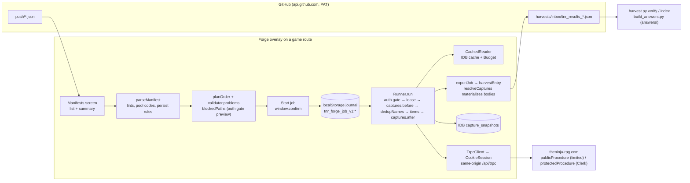

# A. Current-state architecture map: Forge 0.4.0 and Builder v4.32

**Status:** planning evidence, no implementation. Part of the Forge Next planning package (`docs/PLAN_2026-09-12_forge_next.md`).
**Evidence base:** every Forge file under `forge/src/` read in full at `main@305a28f992e33194fbba279a3f32e698dfb2b67f`; `builder_bundle.js` v4.32 read at the same commit; line anchors are from that tree. Tier for every code claim below: Source-verified (repository source) unless marked.

## A.1 The two tools at a glance

| | Builder v4.32 (`builder_bundle.js`, 104,958 bytes, one file) | Forge 0.4.0 (`forge/src`, 27 modules, ~4,000 lines + derived JSON; `forge_bundle.js` 397,984 bytes) |
|---|---|---|
| Host | Injected panel on any game page at `document-idle` (`builder_loader_user.js`); floating `▶ Build` button and a panel built through `R.innerHTML=...` (`builder_bundle.js:794`) | Entry at `/forge` arms the tab and hands off; overlay mounted on a real application route with the game's React/Clerk tree left alive underneath (`forge/src/ui/takeover.mjs:47-53`, `forge/src/main.mjs:75-166`) |
| Contract data | Fetched at every load from the moving `main` ref: `45c`, `32b`, `45g` (`builder_bundle.js:225-230`) | Bundled at build time from the pinned game source: `fields.json`, `nested.json`, `32b_DATA_pool.json` (`forge/build.mjs`, `forge/src/main.mjs:21-27`) |
| Procedure surface | 27 hard-coded paths (jutsu/item/bloodline/gameAsset/quests/profile/ai), plus any `proc` a capture block names | 43 audited procedures with kind, limiter and auth class (`forge/src/transport/procedures.mjs:24-82`); unknown paths throw |
| Wire format | Hand-built superjson meta, regex id scrape, `fetch` per call | Real superjson, tRPC 11 batch envelope derived from the adapter, id read from the decoded `baseServerResponse.message` (`forge/src/transport/outcome.mjs:49`) |
| Rate limit | Eight-try exponential backoff on a limiter hit, up to 60 s per wait (`builder_bundle.js:342,345`), limiter-phrase sniff on error bodies (`:263`) | Per-path sliding-window budget at margin 0.5 mirroring the server's weighted estimate; a 429 halts and pauses the job, never retries (`forge/src/budget/bucket.mjs:169-216`) |
| Durability | `localStorage` idmap `tnr_bk_idmap_v1` (`builder_bundle.js:551`); status rows live only in the panel DOM | Write-ahead job journal in `localStorage`, capture cache and immutable capture snapshots in IndexedDB, pre-create id snapshots, per-job tab lease |
| Ambiguity | A request that never answered is retried or re-run by hand; idempotency relies on the idmap | `SENT` items are reconciled against server state, never retried; ambiguous cases become `ORPHANED` for a human decision |
| Verification | v4.28 asserted-field postflight with one automatic read-back retry | Read-back on asserted keys, `verify: match|drift|unread`, `INCOMPLETE` job state and an `outcome` separate from `state` |
| Captures | `capture.before/after` with `select` projection and `scope` annotations, any procedure, full bodies always in the bundle (`builder_bundle.js:372-375`) | Summary captures by default; `persist:"full"` for seven audited point reads only, 512 KiB ceiling, fail-closed export (`forge/src/storage/captures.mjs:58-84`) |
| Manifest sources | Paste, `📄 Load` file (.json or .zip push pack), `⇩ Repo` picker with multi-select batch builds (`builder_bundle.js:831-871`) | GitHub contents API listing of `push/*.json`, one manifest per job (`forge/src/ui/app.mjs:186-207`) |
| Results | `tnr_results_<ts>.json` committed to `harvests/inbox/` when Sync is on, `cfg: generated`, `checks` array | Same path and PAT key, `cfg: "forge"`, adds `state`, `outcome`, `forgeState`, `verdict`, `journal` (`forge/src/ui/app.mjs:369-406`) |
| Escape hatches | `skipPreflight`, `doctor`, `Map` export/import, paste | None that bypass a safety lint; `Export bundle`, `Export journal as text` |
| Tests | None | 293 socket-free tests across 13 files (`cd forge && npm test`) |

## A.2 Forge module map

Layers are built bottom-up and composed once in `compose()` (`forge/src/main.mjs:35-57`). Every test harness calls the same composition (`forge/test/compose.mjs`).

| Layer | File | Lines | Responsibility | Touches `window`/DOM | UI-independent |
|---|---|---:|---|---|---|
| storage | `storage/journal.mjs` | 423 | Write-ahead job journal in `localStorage`; state machine, transitions table, history repair, migrations, export | no | yes |
| storage | `storage/captures.mjs` | 278 | IndexedDB `tnr_forge` v2: `captures` read cache and `capture_snapshots` immutable evidence; full-persist allowlist and ceiling | no (IDB injected) | yes |
| storage | `storage/compat.mjs`, `storage/hash.mjs` | 49 | Builder-compatible keys (`tnr_bk_idmap_v1`, `tnr_bk_gh_v1`); stable hashing | no | yes |
| transport | `transport/session.mjs` | 54 | The credential seam: `CookieSession` with same-origin path and header allowlists (`:37-38,50`) | no (fetch injected) | yes |
| transport | `transport/client.mjs` | 121 | tRPC batch client; homogeneous batches; `NetworkError` phases | no | yes |
| transport | `transport/envelope.mjs` | 140 | Request/response envelope derived from the tRPC 11 adapter; per-index decode; mutation ambiguity preserved | no | yes |
| transport | `transport/outcome.mjs` | 73 | `baseServerResponse` verdicts, nanoid id extraction, error classification | no | yes |
| transport | `transport/procedures.mjs` | 86 | The audited 43-procedure registry: kind, limited, mcp, auth | no | yes |
| transport | `transport/auth.mjs` | 220 | `AuthState`: page runtime booleans + one server probe; the gate (`assert`, `:210`); server refusal invalidation (`refuse`, `:199`) | no (runtime injected) | yes |
| transport | `transport/upload.mjs` | 79 | uploadthing presign/HEAD/PUT derived from the package the game pins; slug ceilings | no | yes |
| budget | `budget/bucket.mjs` | 218 | Per-path sliding window + weighted estimate, send log written before acquire, trip marker, `RateLimited` | no | yes |
| budget | `budget/reader.mjs` | 87 | Cache-first reads under the budget; `get`/`getMany`/`list` (name lists only) | no | yes |
| runner | `runner/manifest.mjs` | 215 | Parse and validate manifests (`items`/legacy `jutsu`, `capture`, `persist`, pool codes, lints, `readBack`), topological plan, manifest hash | no | yes |
| runner | `runner/validate.mjs` | 256 | Pre-send unknown-key refusal at top level and inside effects/objectives/rules from `fields.json`/`nested.json`; asserted-key diff | no | yes |
| runner | `runner/lints.mjs`, `runner/pool.mjs`, `runner/refs.mjs` | 338 | Ported L-lints, pool-code resolution and kit integrity, `@ref` collection/resolution | no | yes |
| runner | `runner/recipes.mjs` | 106 | Per-entity procedure recipes; update merge that picks the pinned field set; AI kit re-send | no | yes |
| runner | `runner/runner.mjs` | 691 | Job execution: auth gate, lease, captures, dedupNames, two-phase create, fill, rules, verify, pause reasons, adopt/skip | no (`Math.random` tab id fallback only) | yes |
| runner | `runner/fields.json`, `runner/nested.json` | 411 + 4,603 | Derived contracts from the pin (`forge/tools/derive_fields.mjs`, `derive_nested.mjs`) | no | data |
| reconcile | `reconcile/reconciler.mjs` | 156 | Pre-create id snapshots, `SENT` resolution per phase, cross-job ownership, `AuthRefused` surfacing | no | yes |
| repo bridge | `github.mjs` | 89 | Contents API list/raw/put with the stored PAT; `GH` constants (`:7`) | no (fetch injected) | yes |
| ui | `ui/app.mjs` | 411 | App shell, routing between five screens, **and domain logic that does not belong to a UI layer**: `harvestEntry` (`:29`), `resolveCaptures`/`_materialize` (`:323-366`), `exportJob` (`:369`), `blockedPaths` (`:166`), picker caching under the capture cache path `github.contents` (`:198-200`), `window.confirm` gating (`:172`) | yes | no |
| ui | `ui/screens.mjs` | 329 | Five screen render functions (`:11,73,163,260,303`), orphan card, selected-manifest card | yes | no |
| ui | `ui/styles.mjs`, `ui/dom.mjs` | 123 | Scoped CSSOM stylesheet, `h()` element helper, no HTML string sink | yes | no |
| ui | `ui/takeover.mjs` | 201 | Entry/carrier boot mechanics, per-tab arm marker, body readiness, overlay mount, old-builder node suppression (`:53,171`) | yes | no |
| root | `main.mjs` | 173 | Composition root and boot decision (entry / host / inert) | yes | no |

**Reading of the map.** Everything below `ui/` is already UI-independent and injectable (storage, IndexedDB, fetch, clock, auth runtime). The seam the brief asks about for future shell/native hosting (§12.3) exists today at `compose()`; the leakage is the other way round: `ui/app.mjs` owns export/harvest mapping, capture materialization and auth-blocking decisions that a second UI or a shell would have to duplicate.

## A.3 Data flow



Boot (`forge/src/main.mjs:75-166`, `forge/src/ui/takeover.mjs`):

1. `/forge` is a providerless global-not-found render; Forge stops the page, arms `sessionStorage` `tnr_forge_armed_v1` with a hop count, shows a splash and `location.replace("/")`.
2. On any game page in an armed tab it waits for `document.body`, appends one fixed overlay `.f-host`, composes the graph, mounts the app, resets hops, then runs `establishAuth()` (wait for `window.Clerk.loaded`, one `profile.getAi` probe with a sentinel id, error code only).
3. On an unarmed page it returns before touching the document. `MAX_HOPS = 2` bounds redirect loops.

Resume and reconciliation (`forge/src/runner/runner.mjs:242-291`, `forge/src/reconcile/reconciler.mjs:94-158`): the auth gate runs before any read; each `SENT` item is resolved per phase (create via pre-create id snapshot diff, update via asserted-key comparison, rules-toggle via `aiProfileId`, rules via profile comparison); `confirm` continues at the next phase, anything else becomes `ORPHANED` with candidates and pauses the job at that item. A read refused as unauthenticated raises `AuthRefused` instead of orphaning.

## A.4 Lifecycle state machines

Job states (`forge/src/storage/journal.mjs:34`): `RUNNING | PAUSED | DONE | INCOMPLETE | ABORTED`. `DONE` is refused while any item is non-terminal (`:262-274`). Pause reasons recorded on `job.pause`: `TOO_MANY_REQUESTS` (path + until), `SESSION` (auth state, `authRefused`), `NETWORK`, `UNDECODABLE_RESPONSE`, `AMBIGUOUS`, `USER`, `ORPHANED`.

Item states and legal transitions (`:39-47`):

```
PLANNED   → SENT | FAILED | SKIPPED
SENT      → CONFIRMED | ORPHANED | FAILED        (never back to PLANNED: structural)
CONFIRMED → SENT (later phase only, needs entityId, never phase create) | VERIFIED | FAILED
ORPHANED  → CONFIRMED (adopted) | FAILED | SKIPPED
VERIFIED, FAILED, SKIPPED: terminal
```

Phases per item: `create → update → rules-toggle → rules → verify`; the phase written on `CONFIRMED` is the *next* step, so a resume after a read-back failure can only read (`forge/src/runner/runner.mjs:1-19`). `withSent()` flushes `SENT` synchronously, yields one macrotask, then issues the request (`journal.mjs:330-335`).

Outcome (`journal.mjs:76-88`): `success` only when every item is `VERIFIED` with `verify: match` and every requested full capture body was persisted; `failed` on any `FAILED` item or an unpersisted capture-only body; `unverified` for drift, unread, skipped orphans or unresolved items; `open` while running or paused. This is the value the run screen, the toast and the exported bundle report.

Capture persistence: `summary` (journal entry `{phase, proc, input, ok, rows, error}`) or `full` (adds `persist`, `snapshotKey`, `bytes`, `persistOk`, `persistError`; body in `capture_snapshots` keyed `jobId::phase::ordinal`, exported by `resolveCaptures`).

## A.5 Storage model

| Store | Key or name | Written by | Notes |
|---|---|---|---|
| `localStorage` | `tnr_forge_job_v1:<jobId>` | `Journal` | v1 records; `MIGRATIONS` table empty (`journal.mjs:407`); `repairHistory` restores a `PLANNED` item that carries send timestamps to `SENT` |
| `localStorage` | `tnr_forge_sendlog_v1` | `Budget` | send log written before `acquire` resolves; trip marker |
| `localStorage` | `tnr_forge_snap_v1:<jobId>:<entity>` | `Reconciler.beforeCreate` (`reconciler.mjs:68`) | pre-create id snapshots, dropped when the job completes |
| `localStorage` | `tnr_forge_lease_v1:<jobId>` | `Runner._lease` | one driving tab per job, 30 s heartbeat (`runner.mjs:40`) |
| `localStorage` | `tnr_bk_idmap_v1`, `tnr_bk_gh_v1` | both tools | retained Builder keys: `srcId → id` and image name → URL; `{on, pat}` |
| `sessionStorage` | `tnr_forge_armed_v1`, `tnr_forge_tab` | takeover, boot | per-tab arm marker and tab id; no auth material |
| IndexedDB `tnr_forge` v2 | `captures` (key `path:id`) | `CaptureCache` | read cache; invalidated per entity/record on writes |
| IndexedDB `tnr_forge` v2 | `capture_snapshots` (key `jobId::phase::ordinal`) | `Runner._persistFull` | immutable evidence; never invalidated; deleted per key or per job |
| IndexedDB `tnr_forge` | `captures` under path `github.contents` | `App.loadPicker` (`app.mjs:198-200`) | manifest text cached under the *read cache*, keyed by GitHub blob sha; a design smell (repo data in the game read cache) |

`navigator.storage.persist()` is requested best-effort on mount (`app.mjs:408-410`); whether Firefox Android grants it is unverified (Inferred).

## A.6 Contracts and pins

- Procedure registry: 43 rows transcribed from the client-contract audit at `345d18ac` with the verification's corrections; `auth` recorded explicitly, never derived from `limited` (`procedures.mjs:13-22`). `LIMITED_PATHS` = the 16 `publicProcedure` reads. Anything outside the registry throws at `procedure()`.
- Field sets: `fields.json` (jutsu 42, item 71, bloodline 11, quest 29, gameAsset 10, ai 157 keys) and `nested.json` (effect tags, objectives, rule conditions/actions, envelopes) derived from the pin by `forge/tools/derive_fields.mjs` / `derive_nested.mjs`; regenerated byte-identically from game `main@62af1b34` on 2026-09-09 (`docs/BUILDER_APP_NOTES.md`, "Source pin"). Drift to the current head `36c5873b` is measured in `E_CONTENT_ADMIN_FEASIBILITY.md` and `evidence/drift.json`.
- Pool codes: `32b_DATA_pool.json` bundled at build (21,934 bytes of the bundle), so a release carries the pool it was built with; Builder fetches the live file at load.
- `45c`/`45d`/`45g` are not consumed by Forge at runtime. `45g.tag_power_max` is deliberately gated out (`validate.mjs:16-20`).
- Pins in force: Forge global pin `345d18accf6d8ea8d8d47ef0e61b5aff7d5a1cf9`; protected-auth task pin `bdec2883748f029a0ecb93505adfdcbae6851fe9`; generated `45x` contracts extracted from `bdec2883` (`docs/reviews/REPO_SIMPLIFICATION_AUDIT.md`); sentinel drift signal at upstream `98d0eca5` (`docs/DRIFT.md`, 2026-09-11); game head read for this plan `36c5873b7b6ee5fd3af717008d7c51b0f185b756` (2026-09-12).

## A.7 Safety invariants the brief names (§5) and where each lives today

| Invariant | Enforced today by | Cite |
|---|---|---|
| Write-ahead journal | `Journal.withSent` flushes `SENT` before the fetch | `journal.mjs:330-335` |
| Explicit PLANNED/SENT/CONFIRMED/VERIFIED | `TRANSITIONS` table; `annotate()` may not touch state or timestamps | `journal.mjs:39-49,338-346` |
| Ambiguous SENT reconciled, never retried | `SENT → PLANNED` absent; `run()` refuses a job with `SENT` items; `resume()` reconciles first | `journal.mjs:41`, `runner.mjs:193,242` |
| Two-phase create recovery and orphan visibility | pre-create snapshots, `_resolveCreate`, `ORPHANED` pauses the job; Jobs screen orphan cards | `reconciler.mjs:68-121`, `runner.mjs:216`, `screens.mjs:45-71` |
| No automatic deletion | no delete procedure is ever called; `Skip` leaves the row; only IDB cache/snapshot deletion behind confirms | `recipes.mjs` (no delete recipe), `screens.mjs:264,288,297,322` |
| Pre-send validation fails closed | unknown top-level and nested keys refused; no nested set means refuse | `validate.mjs:187-303` |
| Verdict from decoded outcome, not HTTP status | `readMutation`/`readCreate`; 207 mixed batches decoded per index | `outcome.mjs:23-56`, `envelope.mjs:69-100` |
| Read-back of asserted fields | `_verify` diffs asserted keys; `unread`/`drift` keep the item non-terminal | `runner.mjs:487-512`, `validate.mjs:323-349` |
| Rate-budget discipline, no 429 loops | `Budget.acquire` waits; a 429 persists a trip marker; no retry path exists | `bucket.mjs:169-216` |
| Cookies/session never in artifacts | `AuthState` holds a state string and booleans only; static test forbids `document.cookie`, `__session`, `getToken`, `Authorization` on game requests | `auth.mjs:1-30`, `forge/test/auth.test.mjs` |
| GitHub credential separate from game auth | PAT only in `github.mjs`, sent to `api.github.com`; `CookieSession` header allowlist excludes `authorization` | `github.mjs:1-3,25`, `session.mjs:38` |
| Live writes need an authenticated human action | Start/Resume are taps behind `window.confirm`; the auth gate refuses protected paths unless `READY` | `app.mjs:172,228-262`, `auth.mjs:210` |
| Publishing explicit; hidden-by-default visible | manifests carry `hidden:true` (lint L13 ported); Forge has no publish/unhide action at all today | `lints.mjs`, `recipes.mjs` |
| Sync must not leak protected data to a public repo | `FULL_PERSIST_PATHS` allowlist, 512 KiB ceiling, journal never carries bodies | `captures.mjs:58-84`, `runner.mjs:610-626` |

## A.8 Where Builder still differs at the architecture level

1. **Runtime contract fetch from a moving ref.** Builder reads `45c`, `32b`, `45g` from `raw.githubusercontent.com/.../main/` on every load (`builder_bundle.js:225-230`); a repo push changes what the installed panel validates against. Forge bundles the contracts it was audited with.
2. **Retry as the recovery model.** `postRL`/`getRL` retry a limiter hit up to eight times with exponential backoff to 60 s (`:342,345`), each retry re-debiting the player's money/bank by 1% on a real trip (`docs/PLAN_2026-09-03_builder_app.md` §6). Forge halts.
3. **Idempotency by idmap only.** A crash between create and update leaves a placeholder that only the idmap remembers; there is no journal, no reconciliation and no orphan surface. Forge journals every send.
4. **Verification.** Builder's postflight is a per-row checklist in the bundle; a `live: NONE` row is loud but the panel has no job-level outcome. Forge's `outcome` is fail-closed and `harvest.py verify` treats Forge bundles as fail-closed too (`skills/building-tnr-content/scripts/harvest.py:302-347`).
5. **Capture breadth.** Builder captures any `proc` with `select`/`scope` and always writes full bodies (`:372-375`); Forge restricts durable bodies to seven audited point reads and has no projection. The committed research manifests `push/05` and `push/06` call `combat.getBattleHistory` and `combat.getBattleEntries`, which are outside Forge's registry (Behaviour-proven: `harvests/inbox/tnr_results_1789189076617.json` is a v4.32 bundle).
6. **Manifest ingress.** Builder accepts paste, local `.json`/`.zip` push packs and multi-select batch builds from the repo picker (`:831-871`); Forge lists `push/*.json` only.
7. **Preflight model.** Builder validates enums and bounds from `45g` (with the known `tag_power_max` defect) and lets `skipPreflight` disable the whole check (`:169,719-721`); Forge refuses unknown keys from pinned key sets, never bounds, and `skipPreflight` cannot disable a safety lint.
8. **DOM law.** Builder renders its panel through `innerHTML` (`:794`); Forge's build fails on any `innerHTML` (`forge/build.mjs`).
9. **Diagnostics.** Builder's `doctor` runs live name and target-id checks on demand (`:770-801`); Forge has no equivalent diagnostic screen, only the auth probe.
10. **Host model.** Builder co-exists on every page at `document-idle`; Forge takes an entry hop and an overlay. Both loaders match the whole origin; Forge suppresses Builder's root nodes only while mounted (`takeover.mjs:53,171`).

## A.9 Bundle and startup facts (§12.14)

Measured at `main@305a28f`, tools only, no live request:

| Artifact | Bytes | gzip |
|---|---:|---:|
| `forge_bundle.js` as shipped (esbuild, `minify:false`) | 397,984 | 74,969 |
| same source built with `minify:true` into the scratchpad (not committed) | 232,720 | 52,556 |
| `builder_bundle.js` v4.32 | 104,958 | n/a |

Attribution of the shipped bundle by esbuild section: `src/runner` 204,172 (of which `nested.json` is 96,267 raw and `fields.json` 10,349), `src/ui` 59,501, `src/transport` 28,911, `src/storage` 26,555, `superjson` + `copy-anything` 27,931, `32b_DATA_pool.json` 21,934, `src/budget` 11,269, `src/reconcile` 8,252, `main`/`github` 8,924. The derived contract JSON is the largest single cost; it is parsed on every boot on every game page the loader matches, although `boot()` returns before using it on unarmed pages.

## A.10 Baseline facts a roadmap must not assume away

- Test suite at `main@305a28f`: 293 tests, 292 pass, 1 fail. The failing test (`forge/test/release_loader.test.mjs:47`) requires exactly one `@x-release-pending` marker; the release-pin workflow removes that marker on `main` (`.github/scripts/pin_release.py`), so the suite is red on `main` after every release. The Forge CI workflow last ran on `main` at the merge commit `ce603def` (success) and did not run on the automatic pin commit `d1dbecc`, so CI never observes this red state. Behaviour-proven (workflow run 34545431895; local run in this session).
- Loaders: `forge_loader_user.js` `@version 0.4.0`, `@require` pinned to `ce603def204f585d23837121b86cfdd9fd4c308c`; `builder_loader_user.js` `@version 4.32` pinned to the same commit.
- Journal schema v1 with no migration steps yet; IndexedDB v2 with an additive upgrade.
- `App.loadPicker` stores manifest text in the game read cache under a synthetic path, which `CapturesScreen` lists as if it were a capture and `Clear all` deletes.
- Known debt carried in `docs/BUILDER_APP_NOTES.md` "Not finished": pause button only jsdom-tested; no `select`/`scope` captures; clock-skew residual; carrier page traffic outside the budget's view; nothing exercised in a real browser except by the user's smokes.
