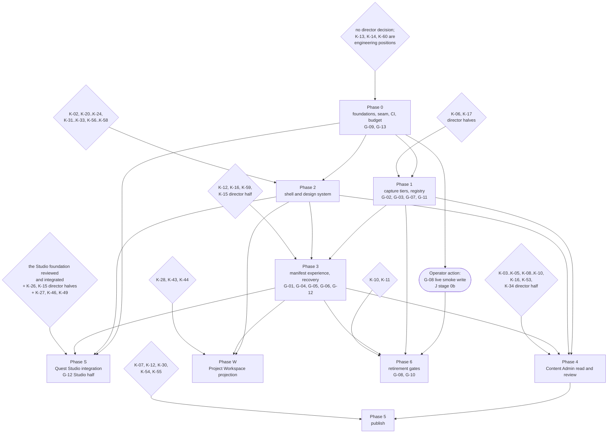

# G. Phased roadmap

**Status:** PLANNING, no implementation. No live game request, no credential material, no game-source change, no manifest-contract migration, no release-pin movement, no Builder deprecation. This section places work in phases; it starts none of it. Part of the Forge Next planning package; context, pins, evidence tiers and method are in `00_CONTEXT.md`.
**Base:** `main@305a28f992e33194fbba279a3f32e698dfb2b67f`. Every `forge/`, `scripts/`, `skills/` and `.github/` line cite is taken at that tree and was opened in this pass. Files that exist only on `chatgpt/forge-quest-studio-foundation@824c4d58075d0265c717ef25c02485614f3096cf` carry the prefix `824c4d58:`.
**Companions:** the architecture this sequences is `F_ARCHITECTURE_RECOMMENDATION.md`; retirement gates G-01 to G-10 are `B_PARITY_MATRIX.md` §B.4 and G-11 to G-13 are `J_MIGRATION_AND_RETIREMENT.md` §J.1; the retirement ordering is J's stage ladder (§J.2) and G does not restate or reorder it; workflows are `C_WORKFLOW_INVENTORY.md` (W-xx); admin classes are `E_CONTENT_ADMIN_FEASIBILITY.md` (CA-xx); destinations and screens are `D_IA_AND_JOURNEYS.md`; tokens, components and the shell slices S1 to S5 are `D_VISUAL_SYSTEM.md` (D2.3, D2.6); risks are `H_RISK_REGISTER.md` (R-xx); decisions are `K_USER_DECISIONS.md` (K-xx). Test architecture is section I, which does not exist at this SHA; forward references to it are written in that form and carry no line cite.

Abbreviations used below, each `docs/design/<file>` at `chatgpt/forge-quest-studio-foundation@824c4d58`, cited as `ABBR:line` or `ABBR §n`: QS = FORGE_NEXT_QUEST_STUDIO.md, RB = FORGE_NEXT_REPO_BACKED_STUDIO_ARCHITECTURE.md, SSC = FORGE_NEXT_SAFETY_STATE_PRESENTATION_CONTRACT.md, CPY = FORGE_NEXT_UI_COPY_AND_STATE_LANGUAGE.md, IRM = FORGE_NEXT_INTERACTION_RISK_MATRIX.md, WCM = FORGE_NEXT_WORKFLOW_COMPONENT_MAP.md, SCN = FORGE_NEXT_UX_SCENARIO_MATRIX.md, EXP = FORGE_NEXT_CONTENT_STUDIO_EXPANSION.md, WSP = FORGE_NEXT_CONTENT_PROJECT_WORKSPACE.md, IDX = FORGE_NEXT_UI_DESIGN_INPUT_INDEX.md, FBRF = `state/prompt_forge_quest_studio_foundation.md`.

## G.0 Scope, principles and how to read a phase

Per-phase acceptance gates are named `PH-<phase>.state` and `PH-<phase>.seam`. The prefix is deliberate: `G-01` to `G-13` are the retirement gates owned by `B_PARITY_MATRIX.md` §B.4 and `J_MIGRATION_AND_RETIREMENT.md` §J.1, and a phase gate is a different thing.

This section answers brief §13-G: reviewable Lane A phases with dependencies and acceptance gates, preferring vertical slices that leave Forge usable at each stage over one rewrite. For every phase it states objective, files and surfaces likely affected, prerequisites, backward-compatibility needs, tests and evidence required, the user decisions that must be settled before implementation, the rollback and fallback story, and the Builder retirement impact by gate id. It settles no user-owned decision: every open `K` entry stays open, and every place where a phase waits on one names it by id.

**What this section may not do.** It may not invent a backend capability (IDX §9). Where the game does not offer something, it is a dependency or a needs-game-change item, never a phase deliverable; `E_CONTENT_ADMIN_FEASIBILITY.md` §E.11 is the list and R-14 is the risk. It may not schedule a live game action as Fable work: a gate clause that needs a real device or a real live tap is the operator's (`CLAUDE.md` §6). It may not begin implementation: no phase starts without a director handoff and a committed implementation brief (`CLAUDE.md` §11, G.5).

**Principles the ordering obeys.**

1. **Vertical slices, usable at every stop.** Each phase leaves a working Forge on the operator's phone and is reviewable on its own SHA. The visual shell follows the same discipline one level down: D2.6 S1 to S5 are individually shippable, and none of them touches `runner/`, `storage/`, `transport/`, `budget/` or `reconcile/`.
2. **One writer per branch, exact-SHA handoffs.** Each phase brief names one implementation owner and one branch (`fable/*` normally; a `claude/*` prefix is a stated deviation, as `00_CONTEXT.md` records for this planning branch). Review targets a frozen SHA, not a branch name (`CLAUDE.md` §§4, 11, 12).
3. **The seam before the surface.** Domain logic moves below the UI seam before the surface grows, because a shell built over a leaking seam duplicates the leak (F.1, F.4; R-13).
4. **Capability existence decides the order, not a channel's priority list.** EXP's P0 set and its phases A to F are Tier B recommendations and are read as inputs, not as an approved order; EXP itself asks for exactly that treatment (EXP:1019). The order below is justified from C (which workflows exist and where), B (which gates release them) and E (what the game already permits). Mission as the flagship end-to-end workflow is implied by QS §15 and by the foundation slice, but it is not a recorded ruling: it stays **K-42**.
5. **A gate that needs a decision is not a schedule.** A phase can be built up to the point where a K entry binds it, and no further. Phases 0 and 1 are shell-independent and need no visual ruling (K-01 "Can defer").
6. **No canonical-owner change rides inside a UI phase.** Blocker codes in `mission.py`, profile-shape enforcement, the workstream validate/render operation, registry and maturity vocabulary alignment, and the branch-namespace rule are separate Lane A briefs with their own gates and their own review (F.17, RM-09, `CLAUDE.md` §7).

**Two gate namespaces, deliberately distinct.** Retirement gates are **G-01 to G-13**, two digits, owned by `B_PARITY_MATRIX.md` §B.4 and `J_MIGRATION_AND_RETIREMENT.md` §J.1; G places them in phases and changes no wording. Per-phase acceptance gates are **PH-<phase>.state** and **PH-<phase>.seam**, where `<phase>` is the phase label (0, 1, 2, 3, S, 4, 5, W, 6). They read:

- **PH-<phase>.state:** no UI class, pill, lamp or label rendered by this phase is computed without a machine source. Every state a screen renders comes from journal, auth, budget, capture, reconcile or sync state as F.10's seam table names it; a component with no row in that table renders nothing rather than deriving a value in the view (SSC §1; R-13, R-16).
- **PH-<phase>.seam:** the execution-core diff list for this phase is empty, or is one reviewed additive item. The list is every file touched under `forge/src/runner/`, `forge/src/storage/`, `forge/src/transport/`, `forge/src/budget/` and `forge/src/reconcile/`. The programme's only intended non-empty entries are the additive `runner.mjs` emit hook (`forge/src/runner/runner.mjs:91` is the existing injected `log` callback it sits beside) and the additive `MIGRATIONS[1]` in the empty table at `forge/src/storage/journal.mjs:407` (F.2, F.8).

**Standing gates, asserted in every phase, not once.** R-01: no control can call a send path while an item is `SENT`; the refusal at `forge/src/runner/runner.mjs:193` and the reconciliation-only path stay the single exit, and the adversarial suite stays unedited. R-27: each of the thirteen UI-level semantic guarantees maps to a kept-green test, and a phase cannot close with an unmapped guarantee. R-06: the bundle size budget on raw and gzip bytes fails a phase that exceeds its declared delta. R-05: the source-drift check on Forge's host and contract surfaces runs per phase, not once. R-02: a user-owned, read-only browser smoke follows each release; it is the operator's, never Fable's.

**Studio phase preconditions, stated once.** No Studio-phase work starts before all four hold: **(a)** the Quest Studio foundation has been independently reviewed by Fable and integrated into `main` — the implementation froze for that review at `chatgpt/forge-quest-studio-foundation@cda8ac76100b2fa4b5429bea27c3c8c80353e240`, after the `824c4d58` snapshot this package read; **(b)** the director half of **K-26** is ruled; **(c)** the director half of **K-15** is ruled; **(d)** every `824c4d58:` cite in this package has been re-resolved at the accepted Studio SHA, with the three paths that changed between the snapshot and `cda8ac76` re-read in full (`00_CONTEXT.md` §00.6 measures which, and which claims survive unchanged). Until then nothing on that branch is assumed to exist here, nothing on it is re-implemented or patched from a Fable branch, and the package cites it by SHA only (RM-01, RM-03; `CLAUDE.md` §4).

**The K register's "Blocks" column.** `K_USER_DECISIONS.md` carries a per-entry "Blocks" pointer written before this section existed, using the labels Phase 0 to Phase 6, "Studio phase" and "Workspace phase". The phase set below uses exactly those labels, so the pointers stay correct and nothing is renumbered. One entry needs a note rather than a change: **K-16** is pointed at Phase 4, and the roadmap needs it one phase earlier, because gate G-06 clause (c) and the orphan affordance live in the phase-3 recovery screen. The entry stays open and `K_USER_DECISIONS.md` remains its owner; this is a scheduling note, not a renumbering.

## G.1 Phase overview

"Shell-dep." says whether the phase cannot be frozen before the phase-2 design decisions (K-20 to K-24) land. "Retirement impact" names the retirement gates the phase makes measurable; the stage those gates open is J §J.2's and is not repeated here.

| Phase | Objective | Depends on | Decisions required first | Per-phase gates | Retirement gates made measurable | Shell-dep. |
|---|---|---|---|---|---|---|
| **0** Foundations and a measured baseline | Green `main`, one CI job, the measurement harness, and the domain logic moved below the seam with the UI byte-identical | none | none; K-13†, K-14† and K-60† are engineering positions the brief fixes | PH-0.state, PH-0.seam | G-09, G-13; enables the operator's G-08 tap | no |
| **1** Research, capture tiers and registry policy | Persistence tiers, paged and filtered list captures, audited registry rows, honest capture verdicts | 0 | K-06 and K-17, director halves only | PH-1.state, PH-1.seam | G-02, G-03, G-07, G-11 (a) and (b) | no |
| **2** Shell and design system | The approved north star as tokens, components and one scoped stylesheet, over the existing screens | 0 | K-01 (ruled), K-02, K-20 to K-24, K-31, K-32, K-33, K-56, K-57, K-58 | PH-2.state, PH-2.seam | none directly | yes |
| **3** Manifest experience and recovery screens | Preflight, run, halt, orphan, results and journaled repository sync, plus the ingress and edit-shape parity slices | 0, 1, 2 | K-12, K-16, K-59, and K-15's director half | PH-3.state, PH-3.seam | G-01, G-04, G-05, G-06, G-12 (non-Studio half) | yes |
| **S** Quest Studio integration | Absorb the reviewed seam: promotion contract, durable Studio state, registry-driven UI, worker observability, one shell | 0, 2, 3, and the three preconditions in G.0 | K-27, K-46, K-49 and K-26's director half; K-25†, K-36†, K-37†, K-38†, K-39†, K-40†, K-50† | PH-S.state, PH-S.seam | G-12 (Studio half, via K-39) | yes for its UI; no for its contracts |
| **4** Content Admin read and review | Queue, record detail, diff, preview and the review package, with no publish act | 1, 2, 3 | K-03, K-04, K-05, K-08, K-09, K-10, K-16, K-53 and K-34's director half; K-47†, K-52† | PH-4.state, PH-4.seam | none directly | yes |
| **5** Publish | The flip, read-back gated, with its own authority lane and confirmation | 4 | K-07, K-12, K-30, K-54, K-55 | PH-5.state, PH-5.seam | none directly | yes |
| **W** Project Workspace projection | Workstream state rendered as one human workspace, read-only first | 2, 3 | K-28, K-43, K-44 | PH-W.state, PH-W.seam | none directly | yes |
| **6** Builder retirement gates | Close the remaining gates, record the ruling, decommission the loader | 1, 3, and the operator's live proof | K-11, K-10 | PH-6.state, PH-6.seam | G-08 verification, G-10, and the standing re-check of all thirteen | no |

**Reading the "Decisions required first" column.** It lists only what a **director** must rule before the phase can be frozen. Entries marked **†** are engineering decisions: `K_USER_DECISIONS.md` §K.1 classes them as Fable's, they carry Fable's position already, and the phase brief fixes and defends them. They are listed so the brief cannot forget them, and they block nothing. A split entry contributes only its director half. This column was rewritten after independent review found that the first draft turned engineering choices into phase blockers, and that phase 0 in particular was blocked by two entries whose own "Can defer" line said yes.

Phases 0, 1 and 2 are the critical path. Phase S, phase 4 and phase W can be scheduled in parallel with each other once their own preconditions hold, because they touch disjoint surfaces; they share only the shell built in phase 2 and the core built in phase 0.

### G.1.1 Retirement gate placement, against J's ladder

G places each gate in the phase where it can first be honestly measured. J §J.2's stage column is reproduced so that the two orderings can be checked against each other at a glance. A phase is when the work happens; a stage is what the operator is allowed to stop using the Builder for. They are different questions and this table is the only place they meet.

| Gate | Owner text | Phase that measures it | Stage it opens (J §J.2) | Decision it cannot close without |
|---|---|---|---|---|
| G-01 zip push packs | B §B.4 | 3 | 2 | none; one clause is a user-controlled live smoke pack |
| G-02 audited registry covers real research | B §B.4 | 1 | 2 | K-17 |
| G-03 paged and filtered list captures | B §B.4 | 1 | 2 | none |
| G-04 partial quest edits | B §B.4 | 3 | 2 | K-59 |
| G-05 enum and task-vocabulary preflight | B §B.4 | 3 | 2 | none |
| G-06 in-tool recovery | B §B.4 | 3 | 2 | K-16 |
| G-07 evidence preservation and honesty | B §B.4 | 1 | 2 | none; one clause needs a device check |
| G-08 live write proof | B §B.4 | operator action after phase 0; verified in 6 | 1 | none; it is a user tap |
| G-09 gates green on main | B §B.4 | 0 | 1 | none; the marker-only fix lands in phase 0 (K-60) |
| G-10 retirement ruling and decommission | B §B.4 | 6 | 5 | K-11 |
| G-11 (a) export refuses above tier | J §J.1 | 1 | 2 | K-06 |
| G-11 (b) research-read tier shipped | J §J.1 | 1 | 3 | K-06, K-17 |
| G-12 ingress parity | J §J.1 | 3, Studio half in S | 3 | K-39 for the Studio half |
| G-13 parity guard green | J §J.1 | 0 | 1 | none |

Two consequences follow. Stage 2 cannot be entered until phases 1 and 3 are both complete, because its entry condition spans G-01 to G-07 plus G-11 clause (a), and those sit in two different phases. And the earliest stage, stage 1, is reachable at the end of phase 0 plus one operator tap, which is why phase 0 is worth doing first even though it changes nothing a director can see.

### G.1.2 Risk coverage

Every risk in `H_RISK_REGISTER.md` lands in at least one phase. "Standing" means the gate is asserted in every phase rather than closed once.

| Risk | Phase that carries the mitigation | Form the gate takes here |
|---|---|---|
| R-01 mutation ambiguity | standing, from 0 | no control reaches a send path while an item is `SENT`; the adversarial suite stays unedited |
| R-02 auth, session, takeover | 0, then standing | host-surface drift check; the post-release browser smoke is user-owned |
| R-03 rate limits | 1, re-asserted in 4 | every new read goes through `CachedReader`; cache-first queue with explicit refresh; no background poll |
| R-04 capture privacy | 1 | tiers with export refusal (K-06) |
| R-05 stale pins and contracts | 0, then standing | contract-data drift job plus the per-phase relevance check (K-13) |
| R-06 mobile performance | 0, then standing | raw and gzip budget failing a phase that exceeds its declared delta (K-14) |
| R-07 repository sync failures | 3 | `job.sync` journaled before the write; repository and game failures never share a control or a colour |
| R-08 admin permission and publish mistakes | 4 read half, 5 publish half | role pre-check and re-check on send; dependency pre-check; read-back |
| R-09 storage migration | 3 | additive `MIGRATIONS[1]` only, own release, two-release rule, park never delete |
| R-10 retirement too early | 6, bounded by 1 and 3 | gates, not decree; the Builder stays installed and pinned |
| R-11 red baseline | 0 | `main` green after the marker-only relaxation lands, with the ChatGPT branch's own fix named in the integration plan (K-60) |
| R-12 confirmation fatigue | 2 mechanism, 5 level | one confirmation surface; the level is K-12 |
| R-13 scope creep into a rewrite | standing, established in 0 | PH-<phase>.seam diff list |
| R-14 game-source dependency | 4 | each admin capability classified zero-change, partial or needs-game-change; the last class is never a deliverable |
| R-15 two loaders on one origin | 2 (release test), 6 (posture) | suppression stays scoped; suppression is never the deprecation mechanism |
| R-16 mockup-implied capabilities | 2, then standing | PH-<phase>.state; every element traces to a capability row |
| R-17 Studio seam operating costs | S | backoff, branch lifecycle (K-37), least-privilege token (K-15, K-26) |
| R-18 Studio state outside the journal | S | durable per-request records; journaled promotion (K-39) |
| R-19 Forge bundles break the parity guard | 0 | gate G-13 |
| R-20 browser versus canonical rule drift | S | generated-projection test |
| R-21 prose-coupled blocker classification | separate canonical-owner brief, scheduled beside S | structured code in `mission.py`, then classification by code |
| R-22 CI duplication and coupled fix | 0 | one Node workflow, `npm audit` restored |
| R-23 canonical under-enforcement of the profile shape | separate canonical-owner brief, after K-36 | selftest on the owner; the browser rule becomes a projection either way |
| R-24 copy or visual grammar collapses axes | 2, re-checked in S | scenario snapshot suite and the icon and motion combinations |
| R-25 toast-only critical state | 2 | durable-surface contract test |
| R-26 authorization denial without a signal | 4 | conditional label, gated on K-34 |
| R-27 a dropped semantic guarantee | standing, mapped in 0 | thirteen guarantees mapped to kept-green tests |
| R-28 shell contaminates the carrier page | 2 | stylesheet contract test plus the release test |
| R-29 template library canonises the flatten experiment | S | defaults come from the selected profile and the approved brief only |
| R-30 accepted art without repository bytes | S packaging | packaging gate requires repository bytes (K-41) |
| R-31 hidden is not confidential | 4 copy, 5 publish copy | copy test |

### G.1.3 Which workflows each phase releases

From `C_WORKFLOW_INVENTORY.md`. A workflow is "released" when it can be performed in Forge without the Builder; workflows that are repository-side rituals are marked as such because Forge only has to stop breaking them.

| Phase | Workflows it releases or unblocks |
|---|---|
| 0 | W-20 release pinning and loader refresh, W-21 session open and close guards (Forge stops breaking the parity guard) |
| 1 | W-04, W-05, W-06, W-07, W-08, and the evidence half of W-13 |
| 2 | none; it changes how existing workflows are performed, not which exist |
| 3 | W-01, W-02, W-03, W-09, W-10, W-11, W-12, and the sync half of W-13 |
| S | W-24 Quest Studio compile loop; W-17 mission authoring reaches the Studio; W-18 event intake only once its compiler exists (K-27) |
| 4 | the review half of W-23; W-16 gains a durable packet surface |
| 5 | the publish half of W-23, in whatever shape K-55 rules |
| W | W-15 and W-25 as projections |
| 6 | none; it removes the parallel tool |

W-14 catalog refresh, W-19 art production and W-22 settings are not released by a single phase: W-14 and W-19 are repository and art-pipeline workflows that Forge consumes rather than performs, and W-22 is touched by phases 0, 2 and 3 together.

## G.2 Phases

### G.2.0 Phase 0: foundations and a measured baseline

**Objective.** Make the baseline green and measurable, consolidate CI, and move the domain logic out of `forge/src/ui/app.mjs` into a headless core with the rendered UI byte-identical. Nothing a director can see changes. That is the point: this phase buys the right for every later phase to be reviewed as a UI change.

| Field | Content |
|---|---|
| Files and surfaces | New `forge/src/core/*`, new `forge/src/hosts/userscript/*` (mostly relocation of `forge/src/ui/takeover.mjs`), `forge/src/main.mjs` `compose()`, `forge/src/ui/app.mjs` (split), `forge/src/ui/dom.mjs` (deny-list, region helper), `forge/build.mjs`, `.github/workflows/forge.yml`, `forge/test/*` |
| Prerequisites | Objective, and all four are checkable rather than answerable: (1) `main` is green, or its baseline defects are isolated and named, which is the release-loader test today (K-60, CF-19, RM-05); (2) the game-source drift check has been re-run against the game head of the day and its result recorded (K-13); (3) the implementation brief names one owner and one branch; (4) the bundle-size and release approach is written down by Fable and reviewable (K-14). None of the four is a director ruling |
| Backward compatibility | The five existing screens render byte-identically; the 16 `forge/test/ui.test.mjs` cases pass unedited; journal stays v1; IndexedDB `tnr_forge` stays at v2 and repository text moves to a **separate** database rather than a new store, so an older pinned bundle never opens it (F.1, F.3 q5); the retained Builder keys `tnr_bk_idmap_v1` and `tnr_bk_gh_v1` are untouched in shape |
| Tests and evidence | The 293 committed cases stay green with the suites below the seam unedited, which is the acceptance evidence for the extraction (75 adversarial, 45 auth, 19 journal and 16 budget cases unmodified; counts from `evidence/forge-tests-ci.json`). Deterministic DOM fixtures for all five screens committed **before** the move and required to come back byte-identical after it; import-direction gate ratcheting cross-seam imports from eleven to zero; a committed headless host test that drives a whole lifecycle with no DOM global; core API surface golden; contract-data drift job re-deriving `forge/src/runner/fields.json` and `nested.json` from the pin; bundle size budget on raw and gzip against A.9's measured baseline; a static no-live-game-URL check over the worker, compiler and Studio files, adopting and widening the one the Studio branch already carries at `cda8ac76:.github/workflows/quest_studio_ci.yml` rather than inventing a second; the existing bundle-reproducibility and fixture jobs kept |
| User decisions | **None.** K-13, K-14 and K-60 are engineering decisions under `K_USER_DECISIONS.md` §K.1 and carry Fable's position; the phase-0 brief fixes and defends them, and independent review checks them. This phase changes nothing a director can see, which is the point of it |
| Rollback and fallback | Re-pin `@require` in `forge_loader_user.js:12` to the previous release commit; `.github/scripts/pin_release.py:24-29` enforces exactly one `@require` per bundle, so rollback is one line. No storage version rises in this phase, so a rollback loses nothing on the device |
| Retirement impact | **G-09** (gates green on `main`) and **G-13** (parity guard green) close here. Both are stage-1 entry conditions in J §J.2, and both are prerequisites of the review-queue work in phase 4 (F.12) |

**CI consolidation.** One Node workflow with one gate set. The Studio slice's `824c4d58:.github/workflows/quest_studio_ci.yml` runs a second `npm ci` and `npm test` (`:56-57`) beside `.github/workflows/forge.yml`, and it carries no `npm audit` step where `forge.yml:44` has one. The Python Studio steps fold into the existing Forge and skillpack jobs rather than a duplicate Node job, and `npm audit` is restored for every path (R-22, U-G-03).

**The red baseline.** `npm test` at `main@305a28f` is 292 of 293: the release-loader test demands a staging marker that `pin_release.py` removes on the default branch (`.github/scripts/pin_release.py:31-32` strips `@x-release-pending`). A fix also sits on the ChatGPT branch, bundled with unrelated assertion changes. Phase 0 lands a minimal Fable-authored relaxation of the marker assertion alone, and the brief records that the other fix exists so integration can drop whichever arrives second (K-60, R-11, R-22, RM-05). This is not a competing claim on a branch: one-writer discipline reserves a branch to one writer, not a file to one branch (`docs/DEVELOPMENT_WORKFLOW.md:112`), and the earlier draft of this paragraph read it the other way.

**The single execution-core edit.** The structured progress emitter beside `runner.mjs:91`. It is advisory: it may not write the journal and may not advance an item state, and an adversarial case asserts that a throwing subscriber leaves journal bytes, write order and the transition sequence identical. It ships on its own SHA so that PH-0.seam has exactly one reviewed entry.

**Operator action enabled, not scheduled by Fable.** Once `main` is green the operator can perform the G-08 live smoke write (J §J.2 stage 0b): one hidden jutsu create with an `@img` upload, a quest edit and an ai edit with rules, committed to `harvests/inbox`. It needs no new code, it is the only way G-08 can ever be closed, and it is the user's tap.

**Risks retired or bounded here.** R-11, R-13, R-19, R-22; R-05 and R-06 gain their standing gates; R-02 gains the host-surface drift check.

### G.2.1 Phase 1: research, capture tiers and registry policy

**Objective.** Give research reads somewhere honest to go: a declared persistence tier per registry entry, paged and filtered list captures with the input actually sent recorded, and capture verdicts that never report an absent body as a persisted one. This is the phase that moves the largest real workload off the Builder, and it needs no shell decision.

| Field | Content |
|---|---|
| Files and surfaces | `forge/src/transport/procedures.mjs` (additive rows only), `forge/src/budget/reader.mjs` (paged input path), `forge/src/storage/captures.mjs` (tier metadata, additive), `forge/src/runner/runner.mjs` capture verdict shaping, `core/captures`, the CR-1 to CR-5 screens in their pre-shell form |
| Prerequisites | Phase 0's seam and gates |
| Backward compatibility | Unknown procedure paths keep throwing before any fetch (`forge/src/transport/procedures.mjs:70-72`); the seven allowlisted full-persistence paths (`forge/src/storage/captures.mjs:58-66`) and the 512 KiB ceiling (`:84`) are not widened by an architecture decision, only by K-06; every archived capture manifest keeps parsing and running |
| Tests and evidence | Registry rows transcribed from the pin under the existing auth invariant; a test that journalled input equals sent input for every list read; a test that a local-only capture never reaches an exported bundle and that a projected capture exports exactly the declared fields; the archived `*.gen.py` generators re-run against a Forge-produced bundle and emit byte-identical manifests; a fixture replaying the null-body bundle shape so `harvest.py verify` prints UNVERIFIED and exits 1; a per-screen budget test asserting no background poll |
| User decisions | **K-06** capture classification and what may persist to a public repository, **K-17** which non-content procedures Forge may call |
| Rollback and fallback | Re-pin the loader. No storage version rises. The Builder remains the tool for any read Forge still refuses; nothing is removed from it |
| Retirement impact | **G-02**, **G-03**, **G-07**, **G-11** clause (a) and clause (b). These release W-04 to W-08 and the census-to-generator loop W-07, and clause (a) is a stage-2 entry condition while clause (b) is stage 3's |

**Why this phase precedes the admin work.** E's zero-game-change call sequence shows that the one step missing on **every** admin class is paged list support in the cached reader: `list()` refuses any path that is not a name list (`forge/src/budget/reader.mjs:76`). A draft queue is therefore a capability gap before it is a UI question, and gate G-03 is the thing that closes it (E §E.2g; F.12's prerequisite list).

**Risks retired or bounded here.** R-04 (capture privacy, under K-06), R-03 (every new read goes through `CachedReader`, enforced by the import-direction gate rather than by discipline), the persistence half of R-10.

### G.2.2 Phase 2: shell and design system

**Objective.** Build the approved visual north star as tokens, components, one scoped stylesheet and the navigation shell, over the existing five screens, with the class names today's tests select on preserved. D2.6 S1, S2 and S3 are this phase; S4 belongs to phases 4 and 5, S5 to phase S.

| Field | Content |
|---|---|
| Files and surfaces | `forge/src/ui/styles.mjs` (content replaced, mechanism preserved), `forge/src/ui/screens.mjs` (per screen), `forge/src/ui/dom.mjs`, the host adapter, new component modules under `ui/` |
| Prerequisites | Phase 0; the predecessor-transcript reconciliation that unblocks K-20 to K-24 |
| Backward compatibility | The stylesheet stays scoped to `.f-host`, `.f-app` and `.f-boot` and never reaches `:root`; `forge/src/ui/takeover.mjs`'s `release()` (`:177-182`) still disconnects the observer and restores the page, so a stage-2 operator can drop back to the Builder in the same tab; `forge/test/ui.test.mjs` selectors keep working |
| Tests and evidence | Stylesheet contract test (every selector scoped, animation allow-list, no external asset, contrast recomputed); a release test asserting no Forge node or style survives `release()`; scenario snapshot suite S-64 to S-67 plus every ICN §19 combination rendered from fixtures; a durable-surface contract test asserting every state on the bad-toast list has a persistent in-workflow surface; touch-target floors measured rather than asserted in prose |
| User decisions | **K-02** navigation model, **K-20** to **K-24** destinations, mode taxonomy, colours, type scale and lane taxonomy, **K-31** background and lane art, **K-32** button variants, **K-33** mode selectable or derived, **K-56** wordmark, **K-57** light theme, **K-58** which actions keep the browser's own confirmation. K-01 is ruled and is a fixed input; what remains open under it is token acceptance at this phase's design freeze |
| Rollback and fallback | Re-pin the loader. This phase writes no storage and calls no new procedure, so its blast radius is the overlay only |
| Retirement impact | None directly. It is a precondition for the phase-3 and phase-4 surfaces that do carry gates |

**Three defects fixed as part of S1, not as a separate cleanup.** The `DONE` pill is painted with the success colour regardless of `jobOutcome` (`forge/src/ui/styles.mjs:44` groups `VERIFIED` and `DONE` on the same `--ok` rule), and two controls sit below the 44 px floor that `.f-app button` already carries at `forge/src/ui/styles.mjs:31`: the exit button at 32 px (`:25`) and the navigation buttons at 40 px (`:27`). These are the visible SSC breaches the visual system records; fixing them inside the slice that rewrites the sheet is cheaper and more reviewable than a follow-up.

**Risks retired or bounded here.** R-12 (the confirmation surface replaces the ten native `confirm` call sites, though the level stays K-12), R-16 (every rendered element traces to a capability row), R-24, R-25, R-28.

### G.2.3 Phase 3: manifest experience and recovery screens

**Objective.** The work package as a job rather than a file: discover, preflight with the consequence stated, run with per-item progress, halt and reconcile, decide an orphan, read back, and sync with a journaled state instead of a textarea. The parity slices that extend the manifest surface ride here because they share the same screens.

| Field | Content |
|---|---|
| Files and surfaces | `core/workPackages`, `core/jobs`, `core/results`, `core/repo`, `forge/src/github.mjs` (wrapped, not rewritten), `forge/src/storage/journal.mjs` `MIGRATIONS[1]` only, the BU-1 to BU-3 and JR-1 to JR-3 screens, the zip pack loader and the quest-edit shape fixtures |
| Prerequisites | Phases 0, 1 and 2; contract tests for `github.mjs` against a fake, which has zero tests today |
| Backward compatibility | Every validated manifest under `push/` and `archive/spent-manifests` keeps parsing and running; no manifest contract migration. Journal v2 is purely additive and ships in a release of its own under the two-release rule, because `migrate()` refuses a record newer than the running bundle (`forge/src/storage/journal.mjs:413`) and rollback is re-pinning the loader; a failed migration parks the record rather than deleting it |
| Tests and evidence | Journal-v2 fixtures replayed from real exported journals; a test that `job.sync` is journaled **before** the contents-API write, so a bundle that never landed is a machine state rather than a textarea (today `Github.put` throws and the bundle is shown as text at `forge/src/ui/app.mjs:402-405`); zip pack replay of the four spent packs with byte-ledger checks that pass on the real ledgers and fail on a one-byte mutation and a missing member; the archived partial-quest-edit shapes with zero problems, and a second fixture asserting the refusal names exactly the three read-only raid columns; derived enum sets with provenance and a FakeGame case proving an enum typo costs no live row; an ingress inventory test enumerating every accepted source |
| User decisions | **K-12** confirmation level, **K-15** credential model, **K-16** deletion policy (needed one phase earlier than the K pointer suggests, see G.0), **K-59** the operator remedy for the three read-only raid columns |
| Rollback and fallback | Re-pin the loader, with the journal-v2 release held to the two-release rule so the previous bundle can still read every record it must reconcile. The Builder still runs any manifest Forge refuses |
| Retirement impact | **G-01** zip packs, **G-04** partial quest edits, **G-05** enum preflight, **G-06** in-tool recovery, **G-12** ingress parity for every route except the Studio one, which waits on K-39 in phase S |

**The credential rule this phase must encode.** Repository reads, repository writes and game work fail independently and are reported independently. The absence of a PAT never implies that live game work is unavailable: reads on a public repository need no credential and writes refuse without one (`forge/src/github.mjs:22-27,50-57`), while the game session is a same-origin cookie session on a different origin. A screen that greys out live work because sync is unconfigured, or reports a failed repository commit as a failed game write, breaks the tool's most important distinction (F.15; R-07, and S-39 in the scenario matrix).

**Risks retired or bounded here.** R-07, R-09, and the recovery half of R-01; R-10's write-path clauses become measurable.

### G.2.S Phase S: Quest Studio integration

**Objective.** Take the independently reviewed and integrated seam and finish it as product: a journaled promotion into the existing preflight, durable per-request Studio state, a registry-driven UI, worker observability, and one shell instead of two. This phase plans **around** the seam and rebuilds none of it.

| Field | Content |
|---|---|
| Files and surfaces | `forge/src/studio/*` after integration, `forge/src/main.mjs` `compose()` (the Studio is installed from the composition every harness calls, not after mount), `core/repo`, the ST-1 to ST-4 screens, the generated subtype and profile projections, `.github/workflows/quest_studio.yml` observability |
| Prerequisites | All three preconditions in G.0: 824c4d58 reviewed and integrated; K-26 ratified or reverted; K-15 ruled. Plus phase 0's core, phase 2's tokens and phase 3's promotion target |
| Backward compatibility | Promotion is an import into the **existing** `parseManifest` and `planOrder` path under the existing auth gate; there is no second validator, no second runner path and no Start control inside the Studio (QS:306-312). The safe-path guard that accepts only paths under the request's build directory is preserved |
| Tests and evidence | A generated-projection test that fails when a browser-side advisory rule encodes a constraint the generated source does not carry; a promotion test proving the only bytes the runner accepts are the ones the envelope names, with provenance journaled (Studio branch, source revision, compiler revision, generated-manifest hash); durable per-request draft records surviving a simulated tab eviction mid-compile; a refusal and cancellation test proving a build that will never land is named within one poll cycle rather than left as silence; and the first end-to-end rehearsal, described below |
| User decisions | **K-25** Quest Source schema, **K-26** trigger, auth and branch architecture, **K-27** subtype rollout order, **K-36** canonical profile-shape enforcement, **K-37** branch namespace retention, **K-38** worker refusal observability, **K-39** the promotion contract, **K-40** workstream linkage, **K-46** graph editing depth, **K-49** policy override, **K-50** adapter boundary |
| Rollback and fallback | Re-pin the loader. The current fallback stays available throughout: a build result is copied and committed by hand, which is what the Studio does today |
| Retirement impact | **G-12**'s Studio half only. The Studio adds a new ingress route, so it must land in the same preflight as every other route or G-12 cannot close |

**The first rehearsal is post-integration, GitHub-only and user-run.** The worker refuses any dispatch that is not on `refs/heads/main` (`824c4d58:.github/workflows/quest_studio.yml:59`) and Forge dispatches its base ref, which defaults to `main` (`824c4d58:forge/src/studio/repository.mjs:52,95`). The seam therefore cannot be exercised from a branch at all. The rehearsal runs after merge to `main`, with a throwaway request identifier, on the operator's own device, and touches no live game. It is the operator's action and Fable verifies the artefacts afterwards (RM-01, RM-03, FBRF).

**Subtype rollout is not adapter work in equal measure.** The registry carries six subtypes: mission `supported`, event `needs_compiler`, and story, battle_pyramid, raid and daily `needs_recipe` (`824c4d58:skills/building-tnr-content/data/49_DATA_quest_studio_subtypes.json:11,30,50,66,82,98`). Event is therefore **new compiler tooling**, an orchestrator over an existing manual build order, and should be estimated as tooling rather than as a form. The four `needs_recipe` types need a recipe before a surface. The order is **K-27** and is the director's; nothing here presumes it.

**The Studio's UI half waits on the shell, its contract half does not.** The promotion contract, the durable per-request state, the worker observability and the registry projections are shell-independent and can be briefed as soon as the three preconditions hold. Absorbing the Studio shell onto the phase-2 token set and the one confirmation surface (D2.6 S5) waits on **K-21** and **K-22**, because a Studio restyled before those are ruled would be a third palette rather than a second one. Build states are also on the content-lifecycle axis and never on the execution lifecycle: a mechanically valid build may not render as a successful execution or as a publication, and the result summary answers compile, execution, verification, sync and publication separately.

**What Fable must not do in this phase.** Duplicate the repository, UI or GitHub primitives, `quest_compile.py`, the registry or the workflows; write a second Mission adapter; add a Start control in the Studio; or treat Tier B channel priorities as an approved order (RM-03).

**Risks retired or bounded here.** R-17, R-18, R-20, R-29, R-30, and R-24's Studio colour debt through the D2.6 S5 absorption. R-21 and R-23 are **not** retired here: they are canonical-owner changes on `mission.py` and are separate briefs (G.4, RM-09).

### G.2.4 Phase 4: Content Admin read and review

**Objective.** Let an authorized administrator see what waits for a decision, understand what changed in content terms, inspect and edit permitted fields, preview where a renderer honestly exists, and record a disposition. No publish act is built in this phase.

| Field | Content |
|---|---|
| Files and surfaces | The AD-1 to AD-4, AD-6 and AD-7 screens, per-class adapters and field allowlists, the review-package read and write path over `core/repo`, D2.6 S4 |
| Prerequisites | Phase 1 (paged list capture, G-03), phase 2 (shell), phase 3 (journaled sync and the results-bundle fix behind G-13), and a role pre-check that is read rather than discovered by a refusal |
| Backward compatibility | Live lifecycle values are never stored, only read and rendered with the read time the reader already returns; the review package is coordination state and never a second canon; the repository paths it writes are disjoint from every path automation rewrites and survive the inbox-compaction ritual |
| Tests and evidence | A fold-the-events test proving status is derived from immutable events and never stored; a staleness test proving a re-read happens immediately before an admin send and refuses on change; a copy test asserting no Forge surface describes a hidden record as private, confidential or unreadable; an authorization test proving `Permission denied` is rendered only when a stable source signal proves role denial, and `Write refused` with the server message otherwise; per-class preview tests that render the neutral no-renderer state where no renderer exists |
| User decisions | **K-03** permission scope, **K-04** editorial-only or arbitrary writes, **K-05** which classes get first-class forms and previews, **K-08** staged package or direct hidden-record edit, **K-09** where approval state lives, **K-10** whether any game-source change is acceptable, **K-16** deletion policy, **K-34** authorization-denial signal, **K-47** annotations store, **K-52** how the surface learns the role, **K-53** whether balance-bearing classes appear at all |
| Rollback and fallback | Re-pin the loader; the review package is append-only files in the repository, so a rollback leaves readable history and destroys nothing. The existing verbal and manifest-based relay still works |
| Retirement impact | None directly. It consumes G-03 and G-13 rather than closing a gate |

**What the phase may not assume.** That an approval field exists anywhere in the game: it does not, on any class (E §E.11). That hidden means confidential: it does not, and R-31 is the risk. That a role denial is distinguishable from any other refusal: an HTTP-200 `success:false` becomes a refusal with no role class today, which is why K-34 exists. That a Content Admin performs the publish act at all: that is **K-55**, a doctrine question, and no phase may assume its answer.

**Risks retired or bounded here.** R-03's admin-queue clause (cache-first with explicit refresh and visible budget, no background poll), R-14, R-26, R-31, and the read half of R-08.

### G.2.5 Phase 5: publish

**Objective.** Make the flip unmistakable, permission-aware and provable, in whatever form K-55 rules. If K-55 says a delegated administrator records a go-ahead rather than performing the act, this phase builds the go-ahead and the user's own confirmation path instead of a publish control, and the gates below apply unchanged to that shape.

| Field | Content |
|---|---|
| Files and surfaces | The AD-5 surface, the publish lane tokens and band, the confirmation surface in its armed form, the dependency pre-check, the read-back path, D2.6 S4's publish half |
| Prerequisites | Phase 4, complete and reviewed |
| Backward compatibility | Publish and edit are the same server call on every class with a lifecycle flag, so a publish inherits every whole-record hazard: fetch, merge, send the whole record, read back, and show the read-back. Engine-law-driven exceptions stay exceptions: where the law says no unhide step is needed, none is built |
| Tests and evidence | A gate test proving the dependency pre-check reads referenced records' visibility before the flip and blocks on an unpublished dependency; a read-back test proving publication is asserted only from a fresh read; a contract test proving a publication never renders with execution-success styling and never implies that execution succeeded; a confirmation test proving the armed surface names the record and the flip in words |
| User decisions | **K-07** which operations are eligible for a few-tap publish, **K-12** final publishing UX and confirmation level, **K-30** late publish visual details, **K-54** whether the product says plainly that hidden is not secret, **K-55** whether a delegated administrator performs the act at all |
| Rollback and fallback | Re-pin the loader. There is no automatic deletion and no production restore anywhere in the game, so the honest reverse of a publish is a compensating edit backed by the pre-write capture the phase-4 composition rule captures automatically |
| Retirement impact | None directly |

**Risks retired or bounded here.** R-08's publish clauses, R-12's publish confirmation level, R-31's copy.

### G.2.W Phase W: Project Workspace projection

**Objective.** Render workstream state as one human workspace: readiness, what needs attention, the work plan, open decisions and evidence, with deep links into the work. Version one writes nothing.

| Field | Content |
|---|---|
| Files and surfaces | The PR-1 and PR-2 screens, a repository read path over `core/repo`, no new Python |
| Prerequisites | Phases 2 and 3 |
| Backward compatibility | No Forge-owned copy of project state exists; the projection is derived on read and never stored as a second canon. A Forge write to project state is impossible before a typed validate-or-render repository operation exists, because validation is Python-only today (`scripts/content_workstream.py:1240-1246` registers `validate` and `render` as subcommands and there is no create) and a phone write to the default branch would race the repository's own automation |
| Tests and evidence | A projection test proving every rendered value is derived from the roadmap document and none is stored; a provenance test proving the rendered revision is shown; an explicit no-write assertion for slice one |
| User decisions | **K-28** how much repository project state Forge may edit directly, **K-43** project creation scope, **K-44** lifecycle vocabulary |
| Rollback and fallback | Re-pin the loader. A read-only projection has no state to roll back |
| Retirement impact | None |

### G.2.6 Phase 6: Builder retirement gates

**Objective.** Close the remaining gates, verify the operator's live proof, record the ruling, and decommission the loader. This phase executes J's ladder; it does not reorder it.

| Field | Content |
|---|---|
| Files and surfaces | `docs/RULINGS.md` (director), `.github/scripts/pin_release.py` `TARGETS` (`:13-16`), the Builder loader and bundle at the repository root, the Settings About block that carries the transition stage |
| Prerequisites | Every gate the earlier phases made measurable, actually measured; the operator's G-08 bundle committed and verified; the standing re-check that no passed gate regressed, which matters for G-02 and G-11 clause (b) because they rest on procedure rows transcribed from a pin |
| Backward compatibility | The shared keys `tnr_bk_idmap_v1` and `tnr_bk_gh_v1` stay readable by both tools until the Builder is uninstalled, so an id created by one is known to the other. The three config files the Builder fetches at load stay at the repository root after the bundle is archived, or a reinstalled Builder runs with weaker preflight |
| Tests and evidence | The full gate table re-measured on the release SHA that the ruling will name; `cd forge && npm test` at 100 percent with the exact count reported; the `CLAUDE.md` §8 gates for any touched skills or docs reported with exact commands and exit codes |
| User decisions | **K-11** timing of deprecation and removal, **K-10** whether any game-source change is acceptable (it bounds which dropped capabilities are permanent) |
| Rollback and fallback | Before stage 5, a regression means dropping back a stage and the Builder is still installed. After stage 5, the fallback is reinstalling the archived loader, which is why stage 5 waits on a ruling rather than a schedule |
| Retirement impact | **G-08** verification and **G-10**, plus the re-check of G-01 to G-07 and G-11 to G-13 on the named release SHA |

**Five things this phase must never do**, taken from J §J.2 and not restated in detail here: use Forge's Builder-node suppression as the deprecation mechanism; mark a gate passed on Inferred evidence; combine the retirement commit with a release pin; migrate by clearing storage; or ship the Builder's removal and the Forge feature that replaces it in the same release.

**Risks retired or bounded here.** R-10, R-15.

## G.3 Dependency graph

Read three things off it. The critical path is 0, 2, 3 with 1 joining before 3; everything else hangs off that spine. Phase S, phase 4 and phase W are siblings, not a chain, and each is gated by its own decision cluster rather than by the others. And the operator's G-08 tap is on the graph because it is a real dependency of phase 6 that no amount of Fable work can supply.

## G.4 What is explicitly not in this roadmap

Each item below is deliberately absent. Naming them is what keeps a later reader from assuming an omission was an oversight.

| Not in the roadmap | Why | Where it lives instead |
|---|---|---|
| An AI assistance layer inside the Studio | Not ruled, and the ruling is the director's | **K-51**, no phase |
| Any TheNinjaRPG source change | The pass's default assumption is no game-source change, and repository access is not game authorization | **K-10**; the wish list with its zero-change fallbacks is E §E.11 |
| Guide Studio and the infographic lane as production lanes | Not ruled; the infographic lane is outside the game-art pipeline by design | **K-29**, not scheduled |
| The guide content class (CA-08) as a phase-4 or phase-5 deliverable | It exists only after the Forge pin, so it cannot be built without a pin move | the **K-13** pin refresh first, then a phase-4 follow-on |
| Structured blocker codes in `mission.py`, canonical profile-shape enforcement, a typed roadmap validate/render operation, registry and maturity vocabulary alignment, and the `studio/*` branch retention rule | Each changes a file whose canonical owner is not Forge; a canonical rule is never fixed by adding a rule to the UI | Separate Lane A briefs with their own gates and review (F.17, RM-09, `CLAUDE.md` §7); decisions **K-36**, **K-28**, **K-37** |
| Re-implementing, patching or re-planning anything on `chatgpt/forge-quest-studio-foundation` | One writer owns that branch | Review findings go to that branch's owner; accepted follow-ons enter phase S (RM-01, RM-02) |
| Re-authoring the ChatGPT branch's unrelated `release_loader` assertion changes | They belong to that branch's owner and its review | phase 0 lands the marker-only relaxation alone; **K-60** records the overlap for integration (RM-05) |
| EXP's channel priorities and its phases A to F as an implementation order | Tier B recommendations, explicitly offered for reconciliation rather than adoption | Reconciled into the order above from B, C and E evidence (RM-07) |
| Graph editing depth, reuse search and a second adapter beyond the K-27 order | Studio v1.5 and v2 scope, not v1 | **K-46**, **K-48**, **K-50** |
| Any deletion affordance | There is no automatic deletion anywhere today, and the policy is unruled | **K-16** |
| Broadening the full-capture allowlist or the 512 KiB ceiling as an architecture consequence | Widening either is a user-owned data-classification decision, not a side effect of a phase | **K-06** |

## G.5 First implementation brief candidates

**Phase 0 can be briefed first, and only phase 0.** It is the single phase with no shell dependency, no admin dependency, no Studio precondition and no capture-policy decision, and it waits on no director ruling at all: K-13, K-14 and K-60 are engineering positions the brief fixes and review checks (§K.1). What it does wait on is objective and checkable: a green or explicitly isolated `main`, a re-run drift check, a named owner and branch, and a written bundle and release approach. Phase 1 is the second candidate and can be briefed in parallel as soon as the director halves of K-06 and K-17 are ruled, because it is also shell-independent.

A phase-0 brief must pin all of the following, or it is not a build contract:

1. **The exact base SHA** and the branch, with one named implementation owner, per `CLAUDE.md` §11 and `docs/workflows/IMPLEMENTATION_HANDOFF.md`. The SHA is the audit target, not the branch name.
2. **The release-loader integration plan (K-60)**: the marker-only relaxation this phase authors, the fact that the ChatGPT branch also carries one, and which of the two integration expects to keep. Fable does not re-author that branch's unrelated assertion changes.
3. **The positions on K-13 and K-14**, defended: whether the game-source pin refresh happens in this phase and against which head, and what the bundle and release approach is. Both change what the phase's size and drift gates assert, and both are Fable's to state and a reviewer's to check.
4. **The exact file list below the seam that may be touched**, expected to be the single additive `runner.mjs` emit hook and nothing else, with the diff gate that reports it.
5. **The DOM fixture set**: which screens, at what viewport, serialized how, committed before the move, and the byte-identical acceptance.
6. **The CI shape after consolidation**: one Node job, the gate list in order, `npm audit` restored, the Python Studio steps folded in, and the static no-live check's file scope.
7. **The bundle budget numbers**: the raw and gzip baseline and the declared delta this phase may spend.
8. **The storage promise**: journal stays v1, `tnr_forge` stays at v2, repository text goes to a separate database, retained Builder keys unchanged.
9. **Socket-free**: every test in the phase runs with no socket and no live request, and the brief says so explicitly.
10. **What is explicitly not in scope**: no screen changes, no new procedure rows, no capture policy change, no Studio file, no Builder change.

The same ten headings are the template for every later phase brief, with the decision list swapped for that phase's K ids from G.1.

**Flagship ordering note.** If the director confirms **K-42**, the Mission brief-to-verified-hidden-build path becomes the demonstration target that phases 1, 3 and S are sequenced to deliver end to end. Until it is confirmed, it is a strong candidate and not an obligation, and no phase's acceptance depends on it.

## G.6 Open decisions routed to K

Director decisions by id; each stays open and `K_USER_DECISIONS.md` is the owner. Engineering entries (§K.1) are named per phase where the brief must fix them, and they block no freeze.

- Phase 0: none. **K-13**, **K-14** and **K-60** are engineering positions recorded in the brief.
- Phase 1: **K-06** and **K-17**, director halves.
- Phase 2: **K-02**, **K-20**, **K-21**, **K-22**, **K-23**, **K-24**, **K-31**, **K-32**, **K-33**, **K-56**, **K-57**, **K-58**. **K-01** is ruled; token acceptance at the phase-2 freeze is what remains under it.
- Phase 3: **K-12**, **K-16** (needed a phase earlier than the register's pointer, see G.0), **K-59**, and **K-15**'s director half.
- Phase S: **K-27**, **K-46**, **K-49**, and the director halves of **K-26** and **K-15**, which decide one credential together. **K-25**, **K-36**, **K-37**, **K-38**, **K-39**, **K-40** and **K-50** are engineering positions the phase-S brief fixes.
- Phase 4: **K-03**, **K-04**, **K-05**, **K-08**, **K-09**, **K-10**, **K-16**, **K-53**, and **K-34**'s director half. **K-47** and **K-52** are engineering positions the phase-4 brief fixes.
- Phase 5: **K-07**, **K-12**, **K-30**, **K-54**, **K-55**.
- Phase W: **K-28**, **K-43**, **K-44**.
- Phase 6: **K-10**, **K-11**.
- Ordering rather than a phase: **K-42**.
- Not scheduled by this roadmap: **K-29**, **K-41**, **K-45**, **K-48**, **K-51**.

Two of these bind more than their phase. **K-55** is a doctrine question about whether a delegated Content Admin performs the publish act at all, so no phase may assume its answer, and phase 5 is written to be buildable either way. **K-15** and **K-26** decide one credential on one device across phases 3 and S together, so ruling them separately would leave one of the two phases planning around a token scope it does not have.
